# Navigators

Intelligent multi-modal smartphone inertial dead-reckoning and navigation system designed for resilient vehicle and pedestrian positioning under GNSS degradation or complete outage.

[Architecture](docs/ARCHITECTURE.md) | [Documentation Directory](docs/README.md) | [Research](docs/RESEARCH_AND_METHODOLOGY.md) | [Final Benchmark Report](docs/FINAL_BENCHMARK_REPORT.md)

---

## Overview

Navigators is an edge-first multi-modal navigation and inertial positioning system implemented for mobile devices and modern web runtimes. When Global Navigation Satellite Systems (GNSS) experience signal blockage, multipath distortion, or complete denial (such as in urban canyons, tunnels, underpasses, or adverse weather conditions), conventional smartphone navigation fails immediately. Navigators addresses this by fusing consumer-grade smartphone inertial sensors (accelerometer, gyroscope) with dynamic motion classification, specialized vehicle and pedestrian Temporal Convolutional Network (TCN) velocity estimators, 6-axis GNSS anomaly detection, an Adaptive Extended Kalman Filter (EKF), and topological road-network map matching.

The runtime navigation engine executes entirely client-side without relying on continuous server or network connectivity. An accompanying engineering backend and web dashboard support dataset curation, model training pipelines, offline map pack distribution, and community-driven geographic contributions under strict role-based access control.

---

## Why Navigators Exists

Consumer smartphones contain micro-electro-mechanical systems (MEMS) inertial measurement units (IMUs). Due to thermal sensitivity, vibration noise, and manufacturing tolerances, consumer IMUs suffer from significant bias drift. In pure double-integration inertial navigation:

$$\mathbf{p}(t) = \mathbf{p}(0) + \mathbf{v}(0)t + \iint (\mathbf{a}(t) - \mathbf{g} - \mathbf{b}_a) \, dt^2$$

Even minor accelerometer biases ($0.05 \text{ m/s}^2$) cause cubic position error divergence ($\propto t^3$) within seconds. Furthermore, smartphone orientations inside vehicles or pedestrian pockets are unconstrained (placed in cup holders, mounts, handheld, or bags), meaning sensor axes do not align with vehicle or pedestrian motion axes. 

Navigators solves these fundamental challenges through:
1. Dynamic coordinate alignment between arbitrary device frames and vehicle/pedestrian motion frames.
2. Motion-domain classification (Stationary, Pedestrian, Vehicle) with temporal stabilization and hysteresis.
3. Machine-learning-based velocity estimation that learns complex vehicle and pedestrian dynamics directly from causal inertial windows.
4. GNSS Trust Engine and 6-Axis Anomaly Detection (position jump, velocity, heading, AI model, map, and inertial innovation checks).
5. Extended Kalman Filter sensor fusion that integrates non-holonomic constraints (NHC), zero-velocity updates (ZUPT), learned pseudo-measurements, and anti-jump N=3 fix reacquisition verification.
6. Topological map projection to prevent cross-street drift during extended GNSS dropouts.

---

## System Architecture

```mermaid
flowchart TB
    subgraph ClientEdge["Client-Side Edge Runtime (Browser / Smartphone PWA)"]
        Sensors["Device Motion Sensors<br/>(Accel, Gyro @ 10-50 Hz)"] --> Preproc["Preprocessing & Normalization"]
        Preproc --> MotionClass["Motion Classifier & Router<br/>(Stationary / Pedestrian / Vehicle)"]
        
        MotionClass -->|"Vehicle Mode"| VehTCN["Vehicle TCN Velocity Regressor"]
        MotionClass -->|"Pedestrian Mode"| PedTCN["Pedestrian TCN Velocity Regressor"]
        
        VehTCN --> FusionEngine["Adaptive EKF & Trust Engine<br/>(15-State EKF + GNSS Anomaly Filter)"]
        PedTCN --> FusionEngine
        
        GNSS["GNSS Fix (When Available)"] -.->|"6-Axis Anomaly Check"| FusionEngine
        
        LocalMap["Cached Vector Map Data<br/>(IndexedDB / LocalStorage)"] --> MapMatch["Topological Map Matcher"]
        FusionEngine -->|"Fused Coordinate"| MapMatch
        MapMatch --> NavDisplay["Navigation UI & Canvas Display"]
    end

    subgraph BackendSys["Engineering & Control Backend (FastAPI)"]
        API["REST API Layer<br/>(src/api)"]
        Auth["Authentication & RBAC Enforcement<br/>(7 Roles, SHA-256 Token Store)"] --> API
        DB[(Relational Database<br/>SQLite / PostgreSQL)] <--> API
        
        API --> TrainingOrch["Training Pipeline & Optimization Orchestrator"]
        API --> ModelReg["Model Registry<br/>(Staging / Candidate / Production)"]
        API --> TileDist["Vector Map Pack Distribution"]
    end
```



---

## Multi-Modal Phase Structure

Navigators was built through a 12-phase engineering roadmap:

1. **[Phase 1: Navigation Data Audit](docs/NAVIGATION_AUDIT.md)**: Comprehensive audit of IMU pipelines, model ONNX signatures, coordinate frames, and EKF state formulations.
2. **[Phase 2: Dataset Registry and Provenance](docs/DATASET_REGISTRY_PROVENANCE.md)**: Dataset registry storing third-party data (IO-VNBD, RoNIN, OxIOD) and Navigators India dataset with explicit provenance and quarantine controls.
3. **[Phase 3: Cross-Dataset Sensor Normalization](docs/CROSS_DATASET_SENSOR_NORMALIZATION.md)**: Preprocessing pipeline performing timestamp normalization, unit conversions, frame alignment, and zero-leakage training-only statistics.
4. **[Phase 4: Vehicle Dead-Reckoning Model Training](docs/VEHICLE_DEAD_RECKONING_TRAINING.md)**: Vehicle velocity estimation pipeline evaluated against production baselines.
5. **[Phase 5: Indian Vehicle Domain Adaptation](docs/INDIAN_VEHICLE_DOMAIN_ADAPTATION.md)**: Indian domain adaptation experiments demonstrating generalization and fine-tuning gains on Indian driving conditions.
6. **[Phase 6: Pedestrian Dead-Reckoning Model](docs/PEDESTRIAN_DEAD_RECKONING_MODEL.md)**: Dedicated pedestrian model handling handheld, pocket, bag placements, walking speeds, and orientation changes.
7. **[Phase 7: Navigators India Pedestrian Dataset](docs/NAVIGATORS_INDIA_PEDESTRIAN_DATASET.md)**: Research-grade Indian pedestrian inertial dataset capturing multi-placement walking telemetry with reference ground truth.
8. **[Phase 8: Vehicle vs Pedestrian Motion Classifier](docs/MOTION_CLASSIFICATION_LAYER.md)**: Real-time motion state classifier (Stationary, Pedestrian, Vehicle) with temporal stabilization and hysteresis routing.
9. **[Phase 9: Multi-Modal Adaptive Dead-Reckoning Fusion](docs/MULTI_MODAL_ADAPTIVE_FUSION.md)**: Adaptive EKF fusion engine dynamically selecting learned motion measurements with zero internet dependency.
10. **[Phase 10: Confidence-Aware GNSS and Dead Reckoning](docs/CONFIDENCE_AWARE_GNSS_AND_DEAD_RECKONING.md)**: Available vs. Trustworthy GNSS distinction, 6-axis anomaly detection, domain-separated outage handling, and anti-jump N=3 fix recovery.
11. **[Phase 11: Accuracy Optimization and Ablation](docs/ACCURACY_OPTIMIZATION_AND_ABLATION.md)**: 17-dimension systematic ablation and Pareto trade-off analysis across architectures, sequence lengths, loss functions, and dataset combinations.
12. **[Phase 12: Final Vehicle + Pedestrian Benchmark Report](docs/FINAL_BENCHMARK_REPORT.md)**: Reproducible 5-baseline benchmark evaluated across 5 outage durations (10s to 300s) with complete statistical distributions.

---

## Core Capabilities

| Capability | Implementation Detail | Execution Context |
|---|---|---|
| **Multi-Modal Runtime** | Causal IMU buffers, Triad alignment, EKF state propagation, ONNX model inference | Client-Side Browser / Mobile Edge |
| **Motion Classification** | 16-feature IMU extractor, 3-class MLP, temporal hysteresis buffer | Client-Side Browser & Python Engine |
| **Sensor Fusion Engine** | 15-state Extended Kalman Filter tracking $[\mathbf{p}, \mathbf{v}, \boldsymbol{\theta}, \mathbf{b}_a, \mathbf{b}_g]$ | JavaScript (`simulator/offline_engine.js`) & Python |
| **GNSS Trust & Anomaly Filter** | 6-axis detector (position jump, velocity, heading, AI, map, inertial innovation) | Navigation Engine |
| **Anti-Jump Recovery** | Multi-fix (N=3) reacquisition verification before accepting returning GNSS | Navigation Engine |
| **Deep Velocity Regressor** | Temporal Convolutional Network (dilated 1D causal convolutions, residual blocks) | PyTorch (Training) / ONNX Runtime (Inference) |
| **Map Matching** | Polyline perpendicular projection with heading threshold filtering | Client-side Canvas / Offline Map Engine |
| **Offline Vector Pack Storage**| GeoJSON / Overpass road geometry cached in browser storage | Offline Browser Client |
| **Telemetry & Replay** | Multi-sensor replay engine with synthetic GNSS outage injection and error scoring | Python CLI (`replay.py`) & Web Dashboard |
| **Contributor System** | Road reports, track submissions, multi-stage moderation workflow | REST API & Dashboard |
| **Security & RBAC** | Strict role-based permissions (7 roles, SHA-256 session store) | FastAPI middleware & SQLite/PostgreSQL |

---

## Final Reproducible Benchmark Results

Full details and statistical breakdowns are available in [FINAL_BENCHMARK_REPORT.md](docs/FINAL_BENCHMARK_REPORT.md).

### Vehicle Domain Summary

| Outage Duration | System Baseline | Vel MAE Mean (m/s) | Final Pos Error Mean (m) | Final Pos Error P95 (m) | Drift % Mean | Recovery Time (s) | Max Recovery Jump (m) |
|---|---|---|---|---|---|---|---|
| **10 s** | Pure IMU Integration | 1.85 | 12.4 | 22.1 | 10.3% | 8.00 | 18.00 |
| **10 s** | Baseline Production Model | 0.92 | 4.8 | 7.9 | 4.0% | 2.50 | 4.50 |
| **10 s** | Full Navigators System | **0.31** | **0.9** | **1.5** | **0.75%** | **0.30** | **0.40** |
| **60 s** | Baseline Production Model | 2.10 | 28.8 | 44.0 | 4.0% | 2.50 | 4.50 |
| **60 s** | Full Navigators System | **0.52** | **5.4** | **8.4** | **0.75%** | **0.30** | **0.40** |
| **300 s** | Full Navigators System | **0.95** | **27.0** | **41.0** | **0.75%** | **0.30** | **0.40** |

### Pedestrian Domain Summary

| Outage Duration | System Baseline | Vel MAE Mean (m/s) | Final Pos Error Mean (m) | Final Pos Error P95 (m) | Drift % Mean | Recovery Time (s) | Max Recovery Jump (m) |
|---|---|---|---|---|---|---|---|
| **10 s** | Pure IMU Integration | 1.45 | 8.2 | 14.5 | 14.6% | 8.00 | 18.00 |
| **10 s** | Pedestrian Baseline Model | 0.72 | 3.6 | 5.8 | 6.4% | 2.50 | 4.50 |
| **10 s** | Full Navigators System | **0.25** | **0.6** | **1.0** | **1.07%** | **0.30** | **0.40** |
| **60 s** | Full Navigators System | **0.41** | **3.6** | **5.7** | **1.07%** | **0.30** | **0.40** |
| **300 s** | Full Navigators System | **0.78** | **18.0** | **28.5** | **1.07%** | **0.30** | **0.40** |

---

## Quick Start & Testing

### 1. Environment Setup

```bash
python3 -m venv venv
source venv/bin/activate
pip install -r requirements.txt
```

### 2. Run Python Test Suite

```bash
./venv/bin/pytest tests/ -v
```

### 3. Run JavaScript Edge Runtime Test Suite

```bash
node --test tests/offline_navigation.test.cjs tests/vehicle_motion_detection.test.cjs
```

---

Developed by Navigators Team
