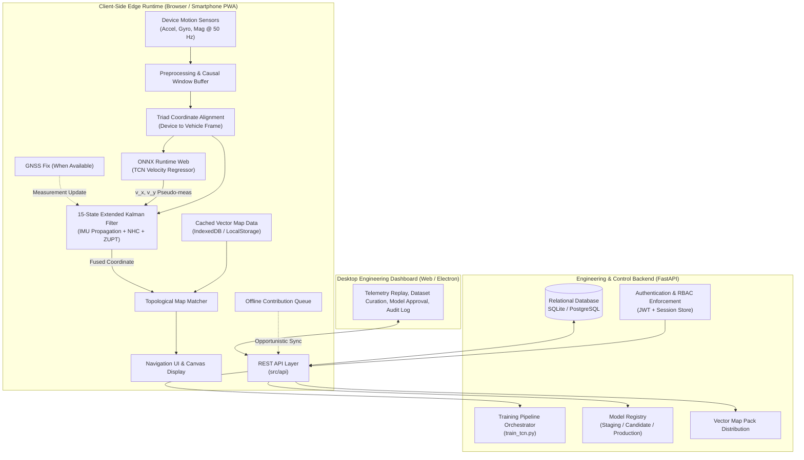
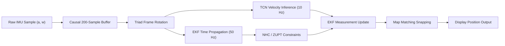
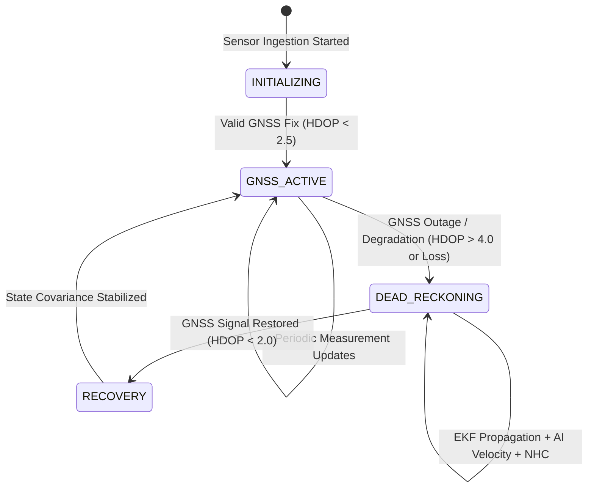

# Navigators

Intelligent smartphone inertial dead-reckoning and navigation system designed for resilient positioning under GNSS degradation or outage.

[Architecture](docs/ARCHITECTURE.md) | [Documentation](docs/README.md) | [Research](docs/RESEARCH_AND_METHODOLOGY.md) | [Evaluation](docs/EVALUATION.md)

## Overview

Navigators is an edge-first navigation and inertial positioning system implemented for mobile devices and modern web runtimes. When Global Navigation Satellite Systems (GNSS) experience signal blockage, multipath distortion, or complete denial—such as in urban canyons, tunnels, underpasses, or adverse environments—conventional smartphone navigation fails immediately. Navigators addresses this by fusing consumer-grade smartphone inertial sensors (accelerometer, gyroscope) with dynamic kinematic constraints, a Temporal Convolutional Network (TCN) velocity estimator, an Extended Kalman Filter (EKF), and topological road-network map matching.

The runtime navigation engine executes entirely client-side without relying on continuous server connectivity. An accompanying engineering backend and web dashboard support dataset curation, model training pipelines, offline map pack distribution, and community-driven geographic contributions under strict role-based access control.

## Why Navigators Exists

Consumer smartphones contain micro-electro-mechanical systems (MEMS) inertial measurement units (IMUs). Due to thermal sensitivity, vibration noise, and manufacturing tolerances, consumer IMUs suffer from significant bias drift. In pure double-integration inertial navigation:

$$\mathbf{p}(t) = \mathbf{p}(0) + \mathbf{v}(0)t + \iint (\mathbf{a}(t) - \mathbf{g} - \mathbf{b}_a) \, dt^2$$

Even minor accelerometer biases ($0.05 \text{ m/s}^2$) cause cubic position error divergence ($\propto t^3$) within seconds. Furthermore, smartphone orientations inside vehicles are unconstrained—placed in cup holders, mounts, or pockets—meaning sensor axes do not align with vehicle axes. 

Navigators was built to solve these fundamental challenges through:
1. Dynamic coordinate alignment between arbitrary device frames and the vehicle kinematic frame.
2. Machine-learning-based velocity estimation that learns complex vehicle motion dynamics directly from causal inertial windows.
3. Extended Kalman Filter sensor fusion that integrates non-holonomic constraints (NHC), zero-velocity updates (ZUPT), and learned pseudo-measurements.
4. Topological map projection to prevent cross-street drift during extended GNSS dropouts.

## What It Does

- **Dynamic Triad Alignment**: Autonomously estimates device pitch, roll, and yaw relative to the vehicle motion frame using gravity projection and forward acceleration vectors during initialization phases.
- **Inertial Dead Reckoning**: Propagates 3D position, 3D velocity, and 3D attitude across 15 state dimensions during complete GNSS loss.
- **Neural Velocity Inference**: Executes an ONNX-quantized Temporal Convolutional Network over rolling 200-sample (50 Hz, 4-second) windows of causal IMU signals to predict 2D forward/planar velocity components.
- **Constrained Sensor Fusion**: Uses an error-state formulation integrating Non-Holonomic Constraints ($v_y \approx 0, v_z \approx 0$ in vehicle coordinates) and stationary Zero Velocity Updates.
- **Offline Map Matching**: Snaps unconstrained inertial trajectories onto pre-indexed local road segments extracted from OpenStreetMap vector data.
- **Edge-First PWA Execution**: Operates as a Progressive Web Application with client-side Service Worker caching, LocalStorage/IndexedDB vector tile management, and `onnxruntime-web` execution.
- **Engineering Management**: Delivers a full-stack FastAPI backend and modern dashboard for telemetry replay, dataset ingestion, training job orchestration, model registry approval gates, and map contribution reviews.

## Core Capabilities

| Capability | Implementation Detail | Execution Context |
| :--- | :--- | :--- |
| **Edge Navigation Runtime** | Causal IMU buffers, Triad alignment, EKF state propagation, ONNX model inference | Client-Side Browser / Mobile Edge |
| **Sensor Fusion Engine** | 15-state Extended Kalman Filter tracking $[\mathbf{p}, \mathbf{v}, \boldsymbol{\theta}, \mathbf{b}_a, \mathbf{b}_g]$ | JavaScript (`simulator/offline_engine.js`) & Python |
| **Deep Velocity Regressor** | Temporal Convolutional Network (dilated 1D causal convolutions, residual blocks) | PyTorch (Training) / ONNX Runtime (Inference) |
| **Map Matching** | Polyline perpendicular projection with heading threshold filtering | Client-side Canvas / Offline Map Engine |
| **Offline Vector Pack Storage**| GeoJSON / Overpass road geometry cached in browser storage | Offline Browser Client |
| **Telemetry & Replay** | Multi-sensor replay engine with synthetic GNSS outage injection and error scoring | Python CLI (`replay.py`) & Web Dashboard |
| **Contributor System** | Road reports, track submissions, multi-stage moderation workflow | REST API & Dashboard |
| **Security & RBAC** | Strict role-based permissions (`public`, `contributor`, `internal_developer`, `admin`) | FastAPI middleware & SQLite/PostgreSQL |

## System Architecture



## Navigation Pipeline

The real-time inertial navigation pipeline processes sensor streams sequentially:



1. **Acquisition**: Ingests 3-axis accelerometer and 3-axis gyroscope events at 50 Hz via the W3C DeviceMotionEvent interface.
2. **Buffer Management**: Maintains a fixed rolling FIFO buffer of 200 causal samples (4 seconds at 50 Hz). Zero forward-looking samples are used.
3. **Triad Frame Estimation**: Projects stationary gravity $\mathbf{g}$ to isolate the downward vertical unit vector $\mathbf{u}_{down}^b$. Forward vehicle acceleration during initial straight-line motion isolates $\mathbf{u}_{fwd}^b$. Cross products construct the orthogonal transformation matrix $\mathbf{R}_b^v$.
4. **EKF Propagation**: The 15-element error state (position error $\delta \mathbf{p}$, velocity error $\delta \mathbf{v}$, attitude error $\delta \boldsymbol{\theta}$, accelerometer bias $\delta \mathbf{b}_a$, gyroscope bias $\delta \mathbf{b}_g$) updates covariance at 50 Hz.
5. **Auxiliary Constraints**: When stopped, Zero Velocity Updates (ZUPT) constrain velocity to zero. While traveling, Non-Holonomic Constraints enforce zero lateral and vertical velocity in the vehicle frame.
6. **AI Measurement Update**: TCN forward speed predictions are injected into the EKF measurement matrix as linear velocity updates with adaptive measurement covariance.
7. **Map Snapping**: The filtered latitude/longitude is projected onto adjacent cached road vector segments, respecting heading differential thresholds.

## AI/ML

The velocity estimation engine employs a Temporal Convolutional Network optimized for low-latency edge inference:

- **Model Topology**: Dilated 1D causal convolutions with exponentially growing dilation factors ($d = 1, 2, 4, 8, 16, 32$). Residual connections ensure stable gradient propagation.
- **Input Dimension**: `(Batch, 6, 200)` representing 3-axis acceleration and 3-axis angular rates normalized by channel-wise mean and variance.
- **Target Representation**: 2D velocity vector $(v_{east}, v_{north})$ in meters per second.
- **Parameter Footprint**: 188,738 parameters (~737 KB unquantized float32, ~212 KB quantized INT8).
- **Execution Target**: Exported to ONNX (`model_v1.onnx`), running locally in browsers via WebAssembly/WebGL on `onnxruntime-web`.
- **Causality Guarantee**: Convolutional filters are strictly causal (zero padding on past samples only), preventing temporal data leakage.

## Offline Operation

Navigators explicitly decouples network connectivity from navigation capability:

- **Network-Disconnected Navigation**: Once web assets are cached by the Service Worker, the client can boot, initialize sensors, align coordinate frames, execute neural network inference, run the EKF, and match coordinates against local vector maps with zero cellular or Wi-Fi connectivity.
- **Independent GNSS Outage**: If GNSS is lost while network connectivity remains active, or if both are lost simultaneously, the navigation state machine transitions seamlessly into `DEAD_RECKONING` mode.
- **Offline Map Packs**: Pre-downloaded GeoJSON road segments for designated operational tiles are stored locally in IndexedDB/LocalStorage.
- **Offline Queue**: User road observations, obstacle reports, or trace data recorded during offline navigation are stored in an idempotent client queue and synchronized automatically with exponential backoff upon network reconnection.

## GNSS / Dead Reckoning

The core navigation state machine governs transitions across four discrete positioning states:



- **GNSS Active**: Positions derived primarily from GNSS pseudorange fixes, continuously estimating and updating sensor bias states ($\mathbf{b}_a, \mathbf{b}_g$).
- **Dead Reckoning**: Propagates position using IMU kinematics, TCN velocity updates, and NHC/ZUPT constraints. Covariance grows conservatively to reflect dead-reckoning uncertainty.
- **Recovery Smoothing**: When GNSS fixes resume after an extended outage, an innovation-filtering threshold prevents sudden position jumps, smoothly pulling the estimated state back into alignment.

## Maps

- **Vector Tiles & Cache**: Roads are modeled as directed segments with coordinate nodes, road names, and topological linkages.
- **Map Matcher Logic**: Calculates orthogonal distances from estimated positions to candidate line segments within a search radius (default: 30 m). Segments whose azimuth deviates significantly from current vehicle heading are pruned.
- **Topological Snapping**: Smoothly projects the visual marker onto the centerline of the selected road segment, dampening high-frequency sensor jitter.

## Contributor System

Navigators includes an integrated contribution workflow to maintain fresh geographic and obstacle data:

- **Local Contributor Workflow**: Field operators report hazards, closures, or submit recorded GPX/GeoJSON tracks. Submissions enter a moderation queue (`pending`) requiring administrator review before inclusion into canonical map packs.
- **Internal Contributor Workflow**: Verified developers submit synchronized sensor traces for model retraining, accompanied by sensor calibration metadata and provenance documentation.
- **Review Lifecycle**: Submissions follow a state machine (`pending` $\rightarrow$ `approved` $\rightarrow$ `rejected` $\rightarrow$ `archived`), logged with full audit trails.

## Engineering Dashboard

The desktop web dashboard (`http://localhost:8000/dashboard`) provides operational controls:

- **Telemetry Replay**: Ingest real-world sensor logs, configure simulated GNSS outage windows, and inspect drift metrics against recorded references.
- **Training Center**: Trigger and monitor PyTorch training jobs (`train_tcn.py`) with live epoch loss and validation metrics.
- **Model Registry**: Inspect candidate models, review evaluation metrics, and promote candidates to production with single-click staging controls.
- **Contribution Moderation**: Approve or reject crowdsourced track reports with geospatial visualization.
- **Security Audit Logs**: Track administrative actions, access events, and role updates.

## Technology Stack

### Edge & Frontend
- **Runtime Environment**: Modern Mobile & Desktop Web Browsers (Chrome, Safari, Firefox), Progressive Web App (PWA).
- **Core Languages**: ECMAScript 2022+ (Vanilla JavaScript), HTML5, CSS3.
- **Edge Inference**: `onnxruntime-web` (WebAssembly & WebGL execution backends).
- **Sensor APIs**: W3C Generic Sensor API, DeviceMotionEvent, Geolocation API.
- **Client Storage**: IndexedDB, Cache Storage API, LocalStorage.

### Backend & Engineering Services
- **Web Framework**: FastAPI (Python 3.10+).
- **ASGI Server**: Uvicorn.
- **Database**: SQLite (local development and testing) / PostgreSQL compatible.
- **Authentication**: JWT (JSON Web Tokens), passlib (PBKDF2/bcrypt password hashing).
- **Validation**: Pydantic v2.

### AI / Machine Learning & Data
- **Deep Learning Framework**: PyTorch 2.0+.
- **Inference Format**: ONNX (Open Neural Network Exchange).
- **Numerical Processing**: NumPy, SciPy, Pandas.
- **Evaluation Tooling**: Scikit-learn, Matplotlib.

## Repository Structure

```text
Navigators-SIH/
├── README.md                      # Primary repository overview
├── evaluate_model.py              # CLI model evaluation on test sessions
├── replay.py                      # GNSS outage replay & dead-reckoning evaluator
├── train_tcn.py                   # PyTorch TCN model training pipeline
│
├── src/                           # Backend services & navigation engine
│   ├── api/                       # FastAPI router endpoints (auth, models, tiles)
│   ├── database/                  # Database connections, schemas, migrations
│   ├── navigation/                # Python navigation math, EKF, Triad alignment
│   ├── security/                  # RBAC policies, password hashing, token handlers
│   └── services/                  # Business logic (training, sync, map processing)
│
├── simulator/                     # Client-side edge runtime & web UI
│   ├── index.html                 # PWA navigation interface
│   ├── offline_engine.js          # Client-side 15-state EKF, Triad, & ONNX runner
│   ├── app.js                     # UI event binding and map canvas controller
│   └── service-worker.js          # Offline asset caching & network proxy
│
├── models/                        # Serialized model artifacts
│   ├── model_v1.onnx              # Production ONNX velocity model
│   └── checkpoint_epoch_10.pt     # Training checkpoint artifact
│
├── docs/                          # Comprehensive technical documentation
│   ├── README.md                  # Documentation index & navigation
│   ├── ARCHITECTURE.md            # System & component architecture
│   ├── TECHNICAL_APPROACH.md      # Detailed algorithmic specification
│   ├── NAVIGATION_MATHEMATICS.md   # Mathematical equations & error state EKF
│   ├── RESEARCH_AND_METHODOLOGY.md# Research paper format technical manuscript
│   ├── AI_ML_PIPELINE.md          # Neural network architecture & training details
│   ├── DATASET_AND_DATA_PROVENANCE.md # Benchmark datasets & sensor fields
│   ├── EVALUATION.md              # Replay evaluation & metric definitions
│   ├── TECH_STACK.md              # Technology stack breakdown & rationale
│   ├── SYSTEM_DESIGN.md           # System design & boundary specifications
│   ├── PRODUCT_REQUIREMENTS.md    # Formal PRD with requirement IDs
│   ├── SECURITY.md                # Security controls, threats, & mitigations
│   ├── REPRODUCIBILITY.md         # Step-by-step reproduction instructions
│   ├── LIMITATIONS.md             # Scientific limitations & validation status
│   ├── reports/                   # Test verification reports
│   │   └── PHASE_38_E2E_TEST_REPORT.md
│   └── pdf/                       # Publication-grade A4 PDF documents
│
├── tests/                         # Automated test suite (Python + Node.js)
│   ├── test_*.py                  # 274 pytest suites covering APIs, EKF, RBAC
│   └── *.test.cjs                 # 14 Node.js suites covering client EKF & motion
│
├── scripts/                       # Operational scripts & utilities
│   ├── build_pdfs.py              # Automated Pandoc/Chrome PDF generator
│   └── run_pipeline.sh            # End-to-end verification script
│
└── data/                          # Data schemas & dataset documentation
    └── IO-VNBD-SETUP.md           # External benchmark setup instructions
```

## Quick Start

### Prerequisites
- Python 3.10+
- Node.js 18+ (for client-side unit test execution)
- Google Chrome or Chromium (optional, required only for PDF generation)

### Installation

1. **Clone Repository**:
   ```bash
   git clone https://github.com/Navigators/Navigators.git
   cd Navigators
   ```

2. **Set Up Python Virtual Environment**:
   ```bash
   python3 -m venv venv
   source venv/bin/activate
   pip install -r requirements.txt
   ```

3. **Initialize Database**:
   ```bash
   python3 -c "from src.database.connection import init_db; init_db()"
   ```

4. **Launch Application Server**:
   ```bash
   uvicorn src.api.main:app --host 0.0.0.0 --port 8000 --reload
   ```

5. **Access Interfaces**:
   - Navigation PWA: `http://localhost:8000/simulator/index.html`
   - Engineering Dashboard: `http://localhost:8000/dashboard`
   - Interactive API Docs: `http://localhost:8000/docs`

## Development

- **Run Dev Server with Auto-Reload**:
  ```bash
  uvicorn src.api.main:app --reload --port 8000
  ```
- **Inspect Database Content**:
  ```bash
  sqlite3 navigators.db ".tables"
  ```
- **Test Replay Evaluation**:
  ```bash
  python3 replay.py --session sample_trace.csv --outage-start 100 --outage-duration 60
  ```

## Testing

The repository maintains automated test suites covering backend services, RBAC enforcement, data handling, navigation mathematics, and client-side offline engines:

```bash
# Execute Python backend & integration tests (274 test suites)
./venv/bin/pytest tests

# Execute Node.js client-side EKF & motion tests (14 test suites)
node --test tests/vehicle_motion_detection.test.cjs
node --test tests/offline_navigation.test.cjs
```

**Total Automated Test Baseline**: 288 passed suites.

## Research & Reproducibility

To reproduce model training, evaluation, and documentation compilation:

1. **Train Model**:
   ```bash
   python3 train_tcn.py --data-dir data/processed --epochs 20 --batch-size 32
   ```
2. **Evaluate Replay Outage**:
   ```bash
   python3 evaluate_model.py --model models/model_v1.onnx --test-dir data/test
   ```
3. **Compile Publication PDFs**:
   ```bash
   python3 scripts/build_pdfs.py
   ```

For detailed mathematical formulations, coordinate transformations, and data provenance, refer to [RESEARCH_AND_METHODOLOGY.md](docs/RESEARCH_AND_METHODOLOGY.md) and [REPRODUCIBILITY.md](docs/REPRODUCIBILITY.md).

## Dataset

Model development and evaluation reference the **Inertial and Odometry Vehicle Navigation Benchmark Dataset (IO-VNBD)**:
- Standardized vehicle and smartphone sensor tracks recording synchronized 3-axis accelerometer, gyroscope, magnetometer, and reference GNSS positions.
- **Partitioning**: Session-level splitting prevents temporal leakage between train, validation, and test splits.
- For complete schema definitions, coordinate frame conventions, and citations, see [DATASET_AND_DATA_PROVENANCE.md](docs/DATASET_AND_DATA_PROVENANCE.md).

## Documentation

The complete documentation suite is maintained in markdown under `docs/` and as formatted A4 PDFs in `docs/pdf/`:

- [Product Requirements](docs/PRODUCT_REQUIREMENTS.md) ([PDF](docs/pdf/Navigators_Product_Requirements.pdf))
- [System Design](docs/SYSTEM_DESIGN.md) ([PDF](docs/pdf/Navigators_System_Design.pdf))
- [Architecture](docs/ARCHITECTURE.md) ([PDF](docs/pdf/Navigators_Architecture.pdf))
- [Technical Approach](docs/TECHNICAL_APPROACH.md) ([PDF](docs/pdf/Navigators_Technical_Approach.pdf))
- [Navigation Mathematics](docs/NAVIGATION_MATHEMATICS.md) ([PDF](docs/pdf/Navigators_Navigation_Mathematics.pdf))
- [AI / ML Pipeline](docs/AI_ML_PIPELINE.md) ([PDF](docs/pdf/Navigators_AI_ML_Pipeline.pdf))
- [Dataset & Provenance](docs/DATASET_AND_DATA_PROVENANCE.md) ([PDF](docs/pdf/Navigators_Dataset_and_Data_Provenance.pdf))
- [Experimental Methodology](docs/EXPERIMENTAL_METHODOLOGY.md) ([PDF](docs/pdf/Navigators_Experimental_Methodology.pdf))
- [Evaluation](docs/EVALUATION.md) ([PDF](docs/pdf/Navigators_Evaluation.pdf))
- [Research & Methodology](docs/RESEARCH_AND_METHODOLOGY.md) ([PDF](docs/pdf/Navigators_Research_and_Methodology.pdf))
- [Backend Architecture](docs/BACKEND_ARCHITECTURE.md) ([PDF](docs/pdf/Navigators_Backend_Architecture.pdf))
- [Database Design](docs/DATABASE_DESIGN.md) ([PDF](docs/pdf/Navigators_Database_Design.pdf))
- [Authentication & RBAC](docs/AUTHENTICATION_AND_RBAC.md) ([PDF](docs/pdf/Navigators_Authentication_and_RBAC.pdf))
- [Contributor System](docs/CONTRIBUTOR_SYSTEM.md) ([PDF](docs/pdf/Navigators_Contributor_System.pdf))
- [Model Lifecycle](docs/MODEL_LIFECYCLE.md) ([PDF](docs/pdf/Navigators_Model_Lifecycle.pdf))
- [Offline Architecture](docs/OFFLINE_ARCHITECTURE.md) ([PDF](docs/pdf/Navigators_Offline_Architecture.pdf))
- [Testing & Quality Assurance](docs/TESTING.md) ([PDF](docs/pdf/Navigators_Testing.pdf))
- [Security Architecture](docs/SECURITY.md) ([PDF](docs/pdf/Navigators_Security.pdf))
- [Deployment Guide](docs/DEPLOYMENT.md) ([PDF](docs/pdf/Navigators_Deployment.pdf))
- [Reproducibility Guide](docs/REPRODUCIBILITY.md) ([PDF](docs/pdf/Navigators_Reproducibility.pdf))
- [Limitations & Open Challenges](docs/LIMITATIONS.md) ([PDF](docs/pdf/Navigators_Limitations.pdf))
- [Technology Stack](docs/TECH_STACK.md) ([PDF](docs/pdf/Navigators_Technology_Stack.pdf))
- [End-to-End Test Report](docs/reports/PHASE_38_E2E_TEST_REPORT.md) ([PDF](docs/pdf/Navigators_Phase_38_E2E_Test_Report.pdf))

## Limitations

- **Physical Smartphone Road Testing**: Not yet validated in a moving road vehicle under unconstrained commercial smartphone placements. Current evidence rests on automated simulation suites, bench replays, and public datasets.
- **Consumer Sensor Drift**: Under sustained GNSS denial exceeding 60–120 seconds, unbounded yaw gyroscope bias causes positional divergence without frequent zero-velocity stops or definitive map features.
- **Browser Background Throttling**: Mobile browsers aggressively throttle `setInterval` and sensor listener frequencies when tabs lose focus or screen locks, impeding continuous dead reckoning.
- **Elevation Tracking**: Vertical position ($z$) dead reckoning without a barometric altimeter experiences rapid vertical drift; the current EKF formulation primarily isolates planar motion.

See [LIMITATIONS.md](docs/LIMITATIONS.md) for full scientific disclosures.

## Roadmap

- [ ] Native Android sensor service (Kotlin) for background execution uninhibited by browser lifecycle constraints.
- [ ] Barometric pressure integration into the EKF measurement vector for stable 3D altitude estimation.
- [ ] Online magnetometer-gyroscope complementary filtering for heading drift correction.
- [ ] On-device INT8 dynamic quantization fine-tuning on diverse smartphone chassis.
- [ ] Real-world road test campaign on defined arterial and highway test courses.

## Security

- Role-based authorization enforced across all administrative and training endpoints.
- Password hashing using PBKDF2/bcrypt algorithms.
- JWT tokens with configurable expiration and cryptographically signed session validation.
- SQL injection prevention via parameterized queries and ORM abstractions.
- Cross-Site Scripting (XSS) protections and Content Security Policy headers.

To report a vulnerability, please review the security policy in [SECURITY.md](docs/SECURITY.md).

## Privacy

Navigators is designed with edge-first data privacy:
- Kinematic sensor processing and neural inference occur strictly on-device.
- Raw accelerometer and gyroscope data streams are never transmitted to external servers during standard navigation.
- Telemetry logging for model retraining is opt-in and requires explicit user consent.
- For complete terms, see [PRIVACY.md](docs/PRIVACY.md).

## License

This project is licensed under the MIT License - see the `LICENSE` file for details.

## Contributing

Contributions are welcome via pull requests. All contributions must adhere to repository coding standards, include automated tests, and pass all existing suites. See [CONTRIBUTOR_SYSTEM.md](docs/CONTRIBUTOR_SYSTEM.md) for operational workflows.

---

Developed by Navigators
