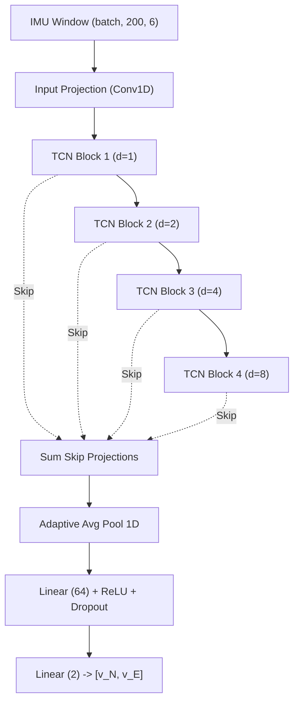

# AI/ML Neural Pipeline Specification

```
Pipeline Modules: src/models/tcn_model.py, src/models/lstm_model.py, src/models/trainer.py
Export Format: ONNX (Open Neural Network Exchange v17)
```

## Overview

Navigators uses deep learning to estimate 2D velocity vectors $[v_N, v_E]$ directly from windowed smartphone IMU signals. This learned pseudo-measurement replaces traditional double-integration of acceleration, bypassing the rapid cubic error divergence caused by sensor bias.

---

## Neural Pipeline Architecture

### Input Representation
- **Sensor Signals**: 6 channels `[acc_x, acc_y, acc_z, gyro_x, gyro_y, gyro_z]`.
- **Window Size**: 200 time steps (20.0 seconds @ 10 Hz sampling rate, or 4.0 seconds @ 50 Hz).
- **Batch Tensor Shape**: `(batch_size, 200, 6)`.

### Production Model Architecture: Temporal Convolutional Network (TCN)
- **Causal Convolutions**: Output at time $t$ depends only on inputs at timesteps $\le t$.
- **Dilated Residual Blocks**: 4 stacked TCN blocks with exponentially increasing dilations ($d \in \{1, 2, 4, 8\}$).
- **Receptive Field**: 127 timesteps, capturing long-term motion dynamics without future leakage.
- **Skip Connections**: Summed projection pathways from all 4 blocks feed into the final projection head.
- **Head**: 1D Adaptive Average Pooling $\to$ Linear (64 units) $\to$ ReLU $\to$ Dropout (0.1) $\to$ Linear (2 units for $[v_N, v_E]$).
- **Parameter Count**: ~480,000 parameters (~1.18 ms CPU inference latency).



---

## Model Lifecycle States

The system maintains strict categorization between model lifecycle tiers:

1. **`PRODUCTION MODEL`**: Officially evaluated, approved, and promoted ONNX model currently deployed to edge runtimes (`simulator/model.onnx`).
2. **`CANDIDATE MODEL`**: Trained model passing validation metrics, awaiting administrative review in the model registry.
3. **`EXPERIMENTAL MODEL`**: Research or ablation model variant tested during hyperparameter search.

Experimental models are NEVER automatically deployed to production without explicit evaluation and administrative approval.

---

## ONNX Export and Edge Inference

- **Export Tool**: `torch.onnx.export` with dynamic batch size axes.
- **Web Execution**: `onnxruntime-web` with WASM backend running client-side inside PWA service workers.
- **Android Execution**: Native ONNX Runtime C++ / Java bindings on mobile targets.
