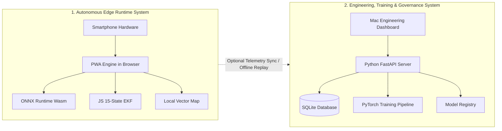

# Navigators — Architecture Document

```
Document Identifier: ARCH-NAV-01
Status: Production Reference
Version: 1.0.0
Last Updated: 2026-09-23
Attribution: Developed by Navigators
```

---

## 1. Architectural Philosophy: Decoupled Systems

A critical architectural distinction in Navigators is the total separation between the **Client-Side Edge Navigation Runtime** and the **Server-Side Engineering & Governance System**:

> [!IMPORTANT]
> **Zero Runtime Dependency**: The Mac Dashboard and Python FastAPI backend are **not runtime dependencies** for smartphone navigation. The client navigation application is entirely self-sufficient on-device once loaded into the browser or installed as a Progressive Web App (PWA).



---

## 2. Edge Navigation Runtime Architecture

The client navigation pipeline executes an unbroken dataflow running on the mobile device's local compute thread:

```
[Smartphone Sensors (Accel, Gyro, Mag, GNSS)]
                      ↓
       [HTML5 DeviceMotion & Geolocation APIs]
                      ↓
  [Sensor Preprocessing: Running Median + Causal Low-Pass]
                      ↓
        [Triad Coordinate Leveling & Heading Alignment]
                      ↓
       ┌──────────────────────────────┐
       │   Branching Signal Fusion    │
       ├──────────────────────────────┤
       │ • 200-sample Window Buffer   │
       │ • TCN Velocity Model (Wasm)  │
       │ • ZUPT Stationary Detector   │
       │ • NHC Kinematic Equations    │
       └──────────────────────────────┘
                      ↓
   [15-State Extended Kalman Filter (State & Covariance)]
                      ↓
        [Geometric Road Network Map Matching]
                      ↓
  [Smooth Anti-Jump GNSS Reacquisition Handler]
                      ↓
   [Navigation Output Canvas & Turn-by-Turn HUD]
```

### Detailed Pipeline Stages:
1. **Sensor Ingestion**: Captures tri-axial linear acceleration with gravity and angular rates.
2. **Causal Preprocessing**: Buffers events at $10\text{ Hz}$. A running median filter removes spurious sensor spikes; a causal 1st-order Butterworth low-pass filter suppresses engine vibrations.
3. **Triad Frame Leveling**: Before motion begins, gravity vector averaging extracts the device pitch and roll angles relative to the Earth frame. Forward acceleration vector alignment resolves the vehicle yaw heading.
4. **AI Velocity Estimation**: A 200-sample sliding window of normalized features feeds the TCN model inside `ort-wasm-simd-threaded.wasm`, producing planar velocity predictions $[v_N, v_E]$.
5. **EKF Kinematic Fusion**: Predicts position propagation using high-rate IMU integration; corrects state estimates using AI velocity pseudo-measurements, Non-Holonomic Constraints ($v_y \approx 0, v_z \approx 0$), Zero Velocity Updates during stops, and GNSS measurements (when available).
6. **Map Matching**: Snaps unconstrained coordinates to OSM vector road centerlines stored in client memory.
7. **Anti-Jump Reacquisition**: When GNSS signals return after an extended outage, the filter caps step-wise corrections to $\le 2\text{ m}$ per cycle over a 10-step horizon to eliminate visual position jumps.

---

## 3. Authentication, Authorization & Security Architecture

The server infrastructure enforces an unbroken chain of trust from incoming HTTP requests to immutable audit logging:

```
[Incoming Request with Bearer Token]
                  ↓
       [Extract & Hash Bearer Token (SHA-256)]
                  ↓
          [Query `sessions` Table]
       (Validate Expiration, Revocation, IP)
                  ↓
       [Resolve Authenticated `User` Entity]
                  ↓
        [Resolve Assigned `Roles` in `user_roles`]
                  ↓
    [Resolve Effective Permissions in `role_permissions`]
                  ↓
      [Evaluate Request via `AuthorizationService`]
    (Check Action, Target Ownership, Resource State)
                  ↓
            ┌───────────┴───────────┐
         ALLOWED                 DENIED
            ↓                       ↓
     [Execute Action]        [Raise HTTP 403 / 401]
            ↓                       ↓
  [Log Audit Record]      [Log Audit Violation]
```

### Key Security Guardrails:
- **Stateless Bearer Hashing**: Raw bearer tokens are never persisted in plaintext. Only the SHA-256 hash is recorded in the `sessions` table.
- **Hierarchical Roles**: 7 discrete roles are supported: `guest`, `user`, `local_contributor`, `internal_contributor`, `moderator`, `team_admin`, and `super_admin`.
- **State Machine Enforcement**: Role permissions alone cannot bypass entity states. For example, a Moderator cannot approve a contribution that is still in `draft` status.
- **Ownership Validation**: Authors possess exclusive rights to edit or withdraw their drafts; non-staff callers cannot view other users' unapproved contributions or private telemetry.

---

## 4. Engineering, Training & Model Lifecycle Architecture

The engineering pipeline provides an auditable, repeatable pathway from raw telemetry ingestion to production model deployment:

```
[Authenticated Internal Contributor]
                  ↓
      [Submit Sensor Telemetry Session]
                  ↓
       [Verify User Data Consent Flag]
                  ↓
    [Automated Dataset Ingestion & Validation]
  (Check Sampling Continuity, Zero NaN, GPS Plausibility)
                  ↓
     [Session-Level Dataset Train/Val/Test Split]
                  ↓
       [PyTorch TCN Training Loop (MPS / CUDA)]
                  ↓
         [Evaluate Model against Benchmark]
                  ↓
     [Register Checkpoint in `models` as 'candidate']
                  ↓
 [Team Admin / Staff Evaluates Candidate Metrics in Dashboard]
                  ↓
            ┌───────────┴───────────┐
        APPROVED                 REJECTED
            ↓                       ↓
  [Export Optimized ONNX]    [Archive Candidate]
            ↓
  [Promote to 'production']
            ↓
[Sync `model.onnx` to Client SW Cache]
```

### Governance Principles:
- **No Automatic Promotion**: Candidate models never replace production models automatically. Promotion requires explicit administrative action recorded in the audit trail.
- **Instant Rollback**: If a newly promoted model displays instability in field testing, administrators can trigger a rollback endpoint that reactivates the previous production checkpoint instantly.
- **Training Parity Verification**: Before deployment, the candidate ONNX artifact is tested against the original PyTorch model on identical input windows to verify numerical parity within $\text{atol} = 10^{-5}, \text{rtol} = 10^{-4}$.

---

Developed by Navigators
