# Navigators — Backend Architecture Specification

```
Document Identifier: BACK-NAV-01
Status: Production Reference
Version: 1.0.0
Last Updated: 2026-09-23
Attribution: Developed by Navigators
```

---

## 1. Architectural Philosophy & Responsibilities

The Navigators backend is an asynchronous Python service built on FastAPI. It does **not** serve as a runtime dependency for real-time vehicular navigation; rather, it provides the central engineering, telemetry ingestion, crowdsourced map curation, model governance, and administrative platform for the Navigators ecosystem.

```mermaid
flowchart TD
    Client["Client / PWA / Mac Dashboard"]
    
    subgraph FastAPI["FastAPI Application Tier (`src/api/server.py`)"]
        AuthMid["Bearer Token Middleware & Session Resolver"]
        AuthzMid["AuthorizationService Guard"]
        
        subgraph Routers["API Routers"]
            AuthRouter["/api/v1/auth"]
            PlacesRouter["/api/v1/places"]
            ContribRouter["/api/v1/contributions"]
            DatasetsRouter["/api/v1/datasets"]
            ModelRouter["/api/v1/models"]
            InternalRouter["/api/v1/internal-contributors"]
            SyncRouter["/api/v1/sync"]
            AdminRouter["/api/v1/admin"]
            AuditRouter["/api/v1/audit"]
        end
    end
    
    subgraph DataAccessLayer["Data Access & Service Tier (`src/db/`)"]
        AuthService["AuthService (`auth_service.py`)"]
        AuthzService["AuthorizationService (`authorization.py`)"]
        ContribRepo["ContributionRepository (`contributions.py`)"]
        DatasetRepo["DatasetRepository (`datasets.py`)"]
        ModelRepo["ModelRegistryRepository (`model_registry.py`)"]
        AuditRepo["AuditRepository (`audit.py`)"]
        StateMachine["ContributionStateMachine (`state_machine.py`)"]
    end
    
    subgraph Storage["Storage Tier"]
        SQLite[("SQLite 3 Database (WAL Mode)")]
        FileCheckpoints["Model Checkpoints (`checkpoints/`)"]
    end

    Client -->|HTTPS Bearer Requests| AuthMid
    AuthMid --> AuthzMid
    AuthzMid --> Routers
    Routers --> DataAccessLayer
    DataAccessLayer --> Storage
```



---

## 2. Router Hierarchy & Endpoint Modularization

All API routes are prefixed under `/api/v1` and strictly isolated into domain-specific modules:

| Router Module | Mount Prefix | Key Responsibilities | Source File |
| :--- | :--- | :--- | :--- |
| **`auth.py`** | `/api/v1/auth` | User registration, password login, token refresh, session revocation, profile fetch. | `src/api/auth.py` |
| **`places.py`** | `/api/v1/places` | Canonical map place search, category filtering, place creation, soft deletion. | `src/api/places.py` |
| **`contributions.py`** | `/api/v1/contributions` | Crowdsourced POI creation, drafting, moderation review, approve, reject, publish. | `src/api/contributions.py` |
| **`datasets.py`** | `/api/v1/datasets` | Sensor telemetry ingestion, dataset sessions, consent verification, triage. | `src/api/datasets.py` |
| **`internal_contributors.py`** | `/api/v1/internal-contributors` | Access request submission, staff review, role upgrade to Internal Contributor. | `src/api/internal_contributors.py` |
| **`model_registry.py`** | `/api/v1/models` | Candidate model registration, benchmark evaluation, production promotion, rollback. | `src/api/model_registry.py` |
| **`sync.py`** | `/api/v1/sync` | Offline contribution queue replay, idempotent client synchronization. | `src/api/sync.py` |
| **`admin.py`** | `/api/v1/admin` | Consolidated telemetry metrics, user role management, system health status. | `src/api/admin.py` |
| **`audit.py`** | `/api/v1/audit` | Query immutable system audit logs with actor, action, and date filters. | `src/api/audit.py` |

---

## 3. Dependency Injection & Authentication Resolver

Endpoints requiring authentication enforce security via FastAPI's `Depends` mechanism:

```python
# Mandatory authentication dependency
@router.post("/items")
def create_item(
    req: CreateItemRequest,
    context: SessionContext = Depends(get_current_session)
):
    ...
```

### Session Resolution Flow (`get_current_session`):
1. **Header Extraction**: Extracts `Authorization: Bearer <raw_token>`. If missing, raises HTTP 401 Unauthorized.
2. **SHA-256 Hashing**: Generates SHA-256 digest of the raw bearer token.
3. **Database Lookup**: Queries `sessions` table where `token_hash = ?` and `revoked_at IS NULL` and `expires_at > datetime('now')`.
4. **Context Construction**: Assembles `SessionContext`:
   - `user`: Resolved `User` object (ID, email, name, status).
   - `roles`: List of assigned `Role` objects.
   - `permissions`: Set of aggregated permission strings (e.g., `contribution:create`, `model:deploy`).
   - `session_id`: Unique identifier for audit correlation.

---

## 4. State Machine Transition Error Handling

All resource lifecycle transitions (submitting drafts, approving contributions, validating datasets) are mediated by `ContributionStateMachine` in `src/db/state_machine.py`. 

Illegal transitions raise `StateTransitionError`, which the API layer transforms into explicit HTTP status codes via `handle_transition_error`:
- Code `"UNAUTHENTICATED"` $\rightarrow$ HTTP 401 Unauthorized.
- Code `"NOT_OWNER"`, `"PERMISSION_DENIED"` $\rightarrow$ HTTP 403 Forbidden.
- Code `"INVALID_STATE_TRANSITION"` $\rightarrow$ HTTP 400 Bad Request.

---

## 5. Audit Logging Architecture

Every state-altering operation executes a transactionally linked audit record via `AuditRepository` in `src/db/audit.py`:
- `action`: Formatted as `<resource>:<operation>` (e.g., `contribution:approved`, `model:promoted`).
- `resource_type` & `resource_id`: Target entity identifiers.
- `actor_id`: User ID initiating the operation.
- `old_state` & `new_state`: Before/after lifecycle status.
- `metadata_json`: Additional diagnostic payload (review notes, rejection rationale).

---

Developed by Navigators
