# Navigators — Contributor System & Workflow Specification

```
Document Identifier: CONTRIB-NAV-01
Status: Production Reference
Version: 1.0.0
Last Updated: 2026-09-23
Attribution: Developed by Navigators
```

---

## 1. Contributor Roles & Dual-Track Architecture

Navigators establishes two distinct contribution workflows:
1. **Local Contributor (Cartographic & Community Enrichment)**: Focuses on mapping road infrastructure, correcting geometry errors, and adding essential points of interest (POIs) such as fuel stations, EV chargers, and medical facilities.
2. **Internal Contributor (Telemetry & AI Model Engineering)**: Focuses on capturing calibrated vehicle sensor telemetry under controlled driving conditions to expand the training corpus for dead-reckoning models.

```mermaid
flowchart TD
    subgraph LocalTrack["Track 1: Local Contributor (Cartographic Track)"]
        User1["Public User"] -->|Drafts Place / POI| Contrib["Contribution Record (`status='draft'`)"]
        Contrib -->|Submits for Review| ReviewQueue["Moderator Review Queue (`status='pending_review'`)"]
        ReviewQueue -->|Moderator Evaluates| Decision{Approved?}
        Decision -->|Yes| CanonicalPlace["Canonical Map Place (`places` Table)"]
        Decision -->|No| RejectFeedback["Rejection with Notes (`status='rejected'`)"]
        CanonicalPlace -->|Online API Ingest| LiveMap["Live Map Rendering"]
        CanonicalPlace -->|Offline Sync Replay| LocalStorageCache["Client PWA Offline Cache"]
    end

    subgraph InternalTrack["Track 2: Internal Contributor (AI Engineering Track)"]
        User2["Authenticated User"] -->|Submits Access Application| AccessReq["Access Request (`internal_access_requests`)"]
        AccessReq -->|Staff Review & Background Check| StaffReview{Approved?}
        StaffReview -->|Yes| UpgradeRole["Assign Role: `internal_contributor`"]
        UpgradeRole -->|Records Calibrated Drives| TelemetryIngest["Dataset Session Ingest (`dataset_sessions`)"]
        TelemetryIngest -->|Automated Data Quality Audit| DataValidation{Continuity & No-NaN?}
        DataValidation -->|Yes| CuratedDataset["Curated Training Split (`datasets` Table)"]
        CuratedDataset -->|Launches PyTorch Training| CandidateModel["Candidate Model (`models` Table)"]
    end
```



---

## 2. Track 1: Local Contributor Lifecycle

### 2.1 Contribution State Machine
All crowdsourced cartographic additions execute the deterministic lifecycle governed by `ContributionStateMachine` in `src/db/state_machine.py`:
- `DRAFT`: Author creates and edits place fields privately. Invisible to non-staff users.
- `SUBMITTED`: Author locks edits and queues the contribution for moderation.
- `PENDING_REVIEW`: Automated triage flags category, spatial bounds, and duplicates.
- `APPROVED`: An independent Moderator (not the author) inspects coordinates and approves the entry.
- `PUBLISHED`: System transactionally creates or updates the corresponding entity in the canonical `places` table and updates `target_resource_id`.
- `CHANGES_REQUESTED`: Reviewer asks for clarifications; contribution returns to draft status for author updates.
- `REJECTED`: Submission fails quality criteria and is closed with explanatory notes.
- `WITHDRAWN`: Author cancels submission prior to final moderation decision.

### 2.2 Ownership & IDOR Protection
- Authors possess exclusive modification rights on their own drafts (`action='contribution:update'`).
- Third-party users cannot view, edit, or delete another user's drafts.
- Moderators cannot review their own submissions (self-moderation is blocked by `AuthorizationService`).

---

## 3. Track 2: Internal Contributor Lifecycle

### 3.1 Access Request Protocol
Because raw sensor telemetry collection and neural training require trusted data provenance, the `internal_contributor` role is not granted automatically:
1. An authenticated user submits `POST /api/v1/internal-contributors/request` specifying hardware setup, vehicle type, and experience.
2. A record is created in `internal_access_requests` with `status = 'pending'`.
3. A Team Admin or Super Admin inspects the application. Upon approval, the server assigns `internal_contributor` role in `user_roles`.

### 3.2 Telemetry Ingestion & Consent Verification
1. Internal contributors upload recorded driving sessions via `POST /api/v1/datasets/sessions`.
2. The payload must include `consent: true`. Ingest without explicit consent is rejected.
3. The dataset validation worker verifies:
   - Zero negative time steps ($\Delta t > 0$).
   - Sensor gap threshold $\le 1.0\text{ s}$.
   - Realistic acceleration bounds ($\|\mathbf{a}\| \le 40\text{ m/s}^2$).
   - Valid GNSS fix coordinates for training ground truth.

---

Developed by Navigators
