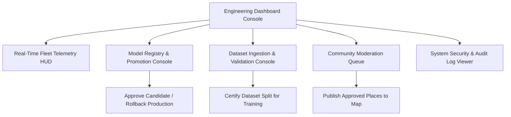

# Navigators — Engineering & Management Dashboard Specification

```
Document Identifier: DASH-NAV-01
Status: Production Reference
Version: 1.0.0
Last Updated: 2026-09-23
Attribution: Developed by Navigators
```

---

## 1. Dashboard Purpose & Operational Scope

The Navigators Engineering Dashboard (`simulator/mac_dashboard.html`) is a desktop web console designed for engineering evaluation, telemetry analysis, model lifecycle governance, and administrative oversight.

> [!IMPORTANT]
> **Not a Runtime Dependency**: The Engineering Dashboard is strictly a management, telemetry analysis, and model governance tool. Physical vehicles navigating with the smartphone client execute fully autonomously on-device and have zero operational dependency on this console.



---

## 2. Core Functional Modules

### 2.1 Real-Time Telemetry & Replay Viewer
- **Side-by-Side Trajectory Comparison**: Loads exported evaluation trajectories (`trip_A_trajectory.json` through `trip_G_trajectory.json`) to visualize the incremental improvements across the seven ablation stages.
- **Metric Gauges**: Renders instant charts for Absolute Trajectory Error (ATE RMSE), Velocity RMSE, Maximum Drift, and ZUPT dwell duration.

### 2.2 Model Registry & Deployment Governance
- **Candidate Inspection**: Displays candidate model parameters (5,400,322), evaluation metrics on held-out test sessions, and ONNX parity check results.
- **One-Click Promotion**: Authorized Team Admins can promote candidate models to production via `POST /api/v1/models/{id}/deploy`.
- **Instant Rollback**: If an active model exhibits abnormal drift in field tests, the dashboard provides a single-click rollback button triggering `POST /api/v1/models/rollback`.

### 2.3 Dataset Certification Console
- **Session Audit**: Lists contributed smartphone trips (`dataset_sessions`) with duration, device model, and user consent verification.
- **Validation Actions**: Enables staff to certify sessions that meet sampling continuity criteria for inclusion in the next model training corpus.

### 2.4 Community Contribution Moderation
- **Moderator Queue**: Displays crowdsourced POIs and road reports in `pending_review` status.
- **Interactive Review Canvas**: Shows proposed place coordinates superimposed on the canonical map. Moderators can approve, reject with notes, or request author revisions.

### 2.5 Audit & Compliance Ledger
- **Activity Stream**: Real-time display of security and state-altering events from `audit_logs` (actor ID, action, resource, timestamp, IP address).
- **Filter Controls**: Enables querying by specific user ID, date ranges, or sensitive actions (e.g., `role:assigned`).

---

Developed by Navigators
