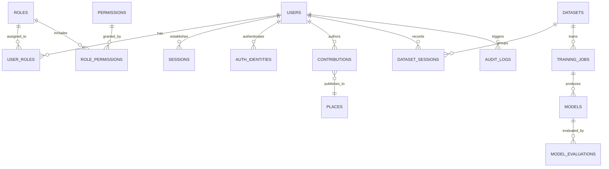

# Navigators :  Database Design & Entity Relationship Specification

```
Document Identifier: DB-NAV-01
Status: Production Reference
Version: 1.0.0
Last Updated: 2026-09-23
Attribution: Developed by Navigators
```

---

## 1. Storage Engine & Architectural Decisions

The Navigators relational data layer is built on **SQLite 3**, configured for high-concurrency embedded operation:
- **Write-Ahead Logging (WAL)**: Enabled via `PRAGMA journal_mode=WAL;`, allowing concurrent readers without blocking writes.
- **Foreign Key Enforcement**: Enforced via `PRAGMA foreign_keys=ON;`, guaranteeing referential integrity across all relationships.
- **Synchronous Mode**: Configured to `PRAGMA synchronous=NORMAL;` for optimal balance between I/O performance and durability.
- **Time Representation**: All timestamps are formatted as ISO-8601 strings in UTC (`strftime('%Y-%m-%dT%H:%M:%fZ', 'now')`).

---

## 2. Entity-Relationship Overview



---

## 3. Comprehensive Table Catalog (19 Tables)

### 3.1 Identity, Authentication & Access Control

#### 1. `users`
Core user account registry.
- `id` (TEXT, PK): Unique user identifier (`usr_...`).
- `email` (TEXT, UNIQUE, NOT NULL): User email address.
- `name` (TEXT, NOT NULL): Display name.
- `status` (TEXT, NOT NULL): Account status (`active`, `suspended`, `pending_verification`, `deleted`).
- `created_at`, `updated_at`, `last_login_at` (TEXT).

#### 2. `roles`
Role definitions for RBAC.
- `id` (TEXT, PK): Role name (`guest`, `user`, `local_contributor`, `internal_contributor`, `moderator`, `team_admin`, `super_admin`).
- `name` (TEXT, UNIQUE, NOT NULL): Human-readable name.
- `description` (TEXT, NOT NULL).

#### 3. `permissions`
Granular atomic authorizations.
- `id` (TEXT, PK): Permission string (`resource:action`, e.g., `contribution:approve`).
- `resource` (TEXT, NOT NULL): Domain entity (`place`, `contribution`, `model`, `dataset`).
- `action` (TEXT, NOT NULL): Operation (`create`, `read`, `update`, `delete`, `approve`).
- `description` (TEXT).

#### 4. `role_permissions`
Many-to-many junction mapping permissions to roles.
- `role_id` (TEXT, FK $\rightarrow$ `roles.id` ON DELETE CASCADE).
- `permission_id` (TEXT, FK $\rightarrow$ `permissions.id` ON DELETE CASCADE).
- Primary Key: `(role_id, permission_id)`.

#### 5. `user_roles`
Many-to-many junction assigning roles to users.
- `user_id` (TEXT, FK $\rightarrow$ `users.id` ON DELETE CASCADE).
- `role_id` (TEXT, FK $\rightarrow$ `roles.id` ON DELETE CASCADE).
- `assigned_at` (TEXT).
- Primary Key: `(user_id, role_id)`.

#### 6. `auth_identities`
Multi-provider authentication credentials.
- `id` (TEXT, PK): Identity record ID.
- `user_id` (TEXT, FK $\rightarrow$ `users.id` ON DELETE CASCADE).
- `provider` (TEXT, NOT NULL): `local_password`, `google`, `apple`.
- `identifier` (TEXT, NOT NULL): Email or OAuth subject ID.
- `credential_hash` (TEXT): Salted password hash.

#### 7. `sessions`
Active bearer token sessions.
- `id` (TEXT, PK): Unique session ID (`ses_...`).
- `token_hash` (TEXT, UNIQUE, NOT NULL): SHA-256 hash of the bearer token.
- `user_id` (TEXT, FK $\rightarrow$ `users.id` ON DELETE CASCADE, NULL for guests).
- `is_guest` (INTEGER, NOT NULL): 1 for anonymous sessions, 0 for authenticated.
- `created_at`, `expires_at`, `revoked_at`, `last_seen_at` (TEXT).
- `user_agent`, `ip_address` (TEXT).

---

### 3.2 Cartography & Community Contributions

#### 8. `places`
Canonical points of interest rendered on the public live map.
- `id` (TEXT, PK): Place identifier (`plc_...`).
- `name` (TEXT, NOT NULL): Location title.
- `category` (TEXT, NOT NULL): `fuel`, `hospital`, `ev_charging`, `pharmacy`, etc.
- `latitude` (REAL, NOT NULL): WGS-84 latitude.
- `longitude` (REAL, NOT NULL): WGS-84 longitude.
- `address`, `phone`, `operating_hours` (TEXT).
- `verified` (INTEGER, DEFAULT 0).
- `status` (TEXT, NOT NULL): `active`, `deprecated`, `deleted`.
- `source` (TEXT, NOT NULL): `canonical`, `community_contribution`.
- `version` (INTEGER, DEFAULT 1).

#### 9. `contributions`
Crowdsourced community submissions with formal lifecycle state machine.
- `id` (TEXT, PK): Contribution ID (`contrib_...`).
- `owner_id` (TEXT, NOT NULL): Author user ID.
- `resource_type` (TEXT, NOT NULL): Target entity type (`place`, `road`).
- `status` (TEXT, NOT NULL): `draft`, `submitted`, `pending_review`, `approved`, `published`, `rejected`, `changes_requested`, `withdrawn`.
- `title` (TEXT, NOT NULL).
- `data_json` (TEXT, NOT NULL): Proposed place attributes in JSON format.
- `reviewed_by` (TEXT, FK $\rightarrow$ `users.id`).
- `review_notes` (TEXT).
- `target_resource_id` (TEXT, FK $\rightarrow$ `places.id`).

---

### 3.3 Telemetry, Machine Learning & Model Registry

#### 10. `datasets`
Curated collections of driving sessions.
- `id` (TEXT, PK): Dataset ID (`ds_...`).
- `name` (TEXT, UNIQUE, NOT NULL).
- `version` (TEXT, NOT NULL).
- `split_json` (TEXT): Train/Validation/Test session mapping.

#### 11. `dataset_sessions`
Individual driving sessions recorded by mobile devices.
- `id` (TEXT, PK): Session ID (`dss_...`).
- `dataset_id` (TEXT, FK $\rightarrow$ `datasets.id`).
- `contributor_id` (TEXT, NOT NULL).
- `activity_type` (TEXT, NOT NULL): `driving`, `walking`.
- `device_model` (TEXT).
- `duration_seconds` (REAL, NOT NULL).
- `consent_verified` (INTEGER, DEFAULT 0).
- `validation_status` (TEXT): `pending`, `validated`, `rejected`.

#### 12. `training_jobs`
Asynchronous neural network training records.
- `id` (TEXT, PK): Job ID (`job_...`).
- `model_architecture` (TEXT, NOT NULL): `tcn`, `lstm`.
- `dataset_id` (TEXT, FK $\rightarrow$ `datasets.id`).
- `status` (TEXT): `queued`, `running`, `completed`, `failed`.
- `hyperparameters_json`, `metrics_json` (TEXT).

#### 13. `models`
Central registry of trained neural checkpoints.
- `id` (TEXT, PK): Model ID (`mdl_...`).
- `name` (TEXT, NOT NULL).
- `version` (TEXT, NOT NULL).
- `architecture` (TEXT, NOT NULL).
- `checkpoint_path`, `onnx_path` (TEXT, NOT NULL).
- `status` (TEXT, NOT NULL): `candidate`, `approved`, `production`, `archived`, `rejected`.
- `is_production` (INTEGER, DEFAULT 0).

#### 14. `model_evaluations`
Benchmark evaluations associated with model candidates.
- `id` (TEXT, PK): Evaluation ID (`eval_...`).
- `model_id` (TEXT, FK $\rightarrow$ `models.id`).
- `dataset_session_id` (TEXT, FK $\rightarrow$ `dataset_sessions.id`).
- `ate_rmse`, `velocity_rmse`, `max_drift_m` (REAL).

---

### 3.4 Governance, Incidents & Operations

#### 15. `internal_access_requests`
User applications to become Internal Contributors.
- `id` (TEXT, PK): Request ID (`req_...`).
- `user_id` (TEXT, FK $\rightarrow$ `users.id`).
- `status` (TEXT): `pending`, `approved`, `rejected`.
- `justification` (TEXT, NOT NULL).
- `reviewed_by` (TEXT).

#### 16. `incident_reports`
User-reported road obstructions, accidents, and hazards.
- `id` (TEXT, PK): Report ID (`rep_...`).
- `reporter_id` (TEXT, NOT NULL).
- `category` (TEXT, NOT NULL): `accident`, `road_closure`, `hazard`.
- `latitude`, `longitude` (REAL, NOT NULL).
- `status` (TEXT): `active`, `resolved`, `false_report`.

#### 17. `sos_alerts`
Emergency vehicular distress signals.
- `id` (TEXT, PK): SOS ID (`sos_...`).
- `user_id` (TEXT, NOT NULL).
- `latitude`, `longitude` (REAL, NOT NULL).
- `status` (TEXT): `triggered`, `acknowledged`, `resolved`, `cancelled`.

#### 18. `audit_logs`
Immutable compliance and security ledger.
- `id` (TEXT, PK): Audit ID (`aud_...`).
- `actor_id` (TEXT): User ID triggering action.
- `action` (TEXT, NOT NULL): e.g., `model:promoted`, `role:assigned`.
- `resource_type`, `resource_id` (TEXT, NOT NULL).
- `old_state`, `new_state` (TEXT).
- `metadata_json` (TEXT).
- `timestamp` (TEXT, DEFAULT now).

#### 19. `sync_queue`
Idempotent server-side replay buffer for offline actions.
- `id` (TEXT, PK): Sync ID (`sync_...`).
- `client_sync_id` (TEXT, UNIQUE, NOT NULL): Client-generated UUIDv4 idempotency key.
- `user_id` (TEXT, NOT NULL).
- `action_type` (TEXT, NOT NULL).
- `payload_json` (TEXT, NOT NULL).
- `processed_at` (TEXT).

---

Developed by Navigators
