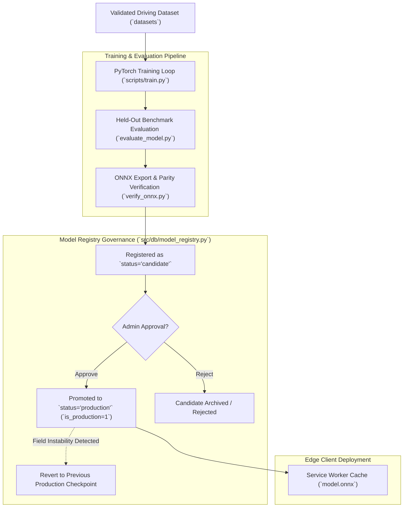

# Navigators :  Model Lifecycle & Governance Specification

```
Document Identifier: MOD-NAV-01
Status: Production Reference
Version: 1.0.0
Last Updated: 2026-09-23
Attribution: Developed by Navigators
```

---

## 1. Governance Principles & Strict Promotion Rules

> [!IMPORTANT]
> **No Automatic Model Replacement**: Under no circumstances does a freshly trained neural network automatically replace an active production model. Promotion to production requires formal benchmark evaluation, parity verification, and explicit authorization by a Team Admin or Super Admin.



---

## 2. Seven-Stage Model Lifecycle

### Stage 1: Data Curation & Preprocessing Contract
The model training loop consumes an approved dataset from `datasets` partitioned using session-level splitting. The normalization contract (`mean`, `std`, `window_size=200`, `imu_frequency=10Hz`) is frozen alongside the training configuration.

### Stage 2: PyTorch Training Execution
`Trainer` in `src/models/trainer.py` executes training:
- Loss function: Multi-task MSE + Angular Heading Error ($\mathcal{L} = \mathcal{L}_{mse} + 0.3 \mathcal{L}_{ang}$).
- Optimizer: AdamW with Cosine Annealing learning rate schedule.
- Checkpoints saved per epoch; `best_model.pt` tracks lowest validation loss.

### Stage 3: Benchmark Evaluation
The model checkpoint is evaluated against the held-out test split (22 independent sessions in IO-VNBD) via `evaluate_model.py`:
- Absolute Trajectory Error (ATE RMSE in meters).
- Velocity vector RMSE ($\text{m/s}$).
- Zero-Velocity error under synthetic stops.

### Stage 4: ONNX Export & Parity Audit
`scripts/verify_onnx.py` exports the model to ONNX format with dynamic batching and tests numerical parity against PyTorch:
- Max Absolute Difference $\le 10^{-5}$.
- Max Relative Difference $\le 10^{-4}$.
- Confirms zero NaN, zero infinite values, and strictly finite float32 outputs.

### Stage 5: Candidate Registration
The model is recorded in the `models` table with `status = 'candidate'` and `is_production = 0`. Its evaluation scores, parameter count (5,400,322), and normalization contract are recorded in `model_evaluations`.

### Stage 6: Administrative Review & Production Promotion
A Team Admin or Super Admin reviews the candidate's metrics in the Engineering Dashboard (`POST /api/v1/models/{id}/deploy`):
- The previous production model's `is_production` flag is atomically toggled to `0`.
- The approved model is set to `status = 'production'` and `is_production = 1`.
- The new `model.onnx` is staged for client PWA service worker distribution.
- An immutable audit entry (`action = 'model:promoted'`) is recorded.

### Stage 7: Emergency Rollback
If a newly promoted model displays instability during field operations:
- An administrator triggers `POST /api/v1/models/rollback`.
- The system identifies the immediately preceding production model version, restores its active production flag, and triggers an immediate Service Worker cache invalidation across client apps.

---

Developed by Navigators
