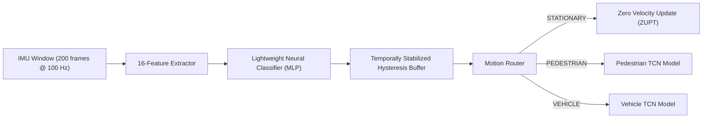

# Motion Classification Layer and Motion Routing

```
Module: src/models/motion_classifier.py
Classes: STATIONARY, PEDESTRIAN, VEHICLE, UNKNOWN
```

## Overview

Before specialized dead-reckoning inference is executed, Navigators routes sensor data through a lightweight **Motion Classification Layer**. 

Because vehicle motion (smooth accelerations, higher speeds, non-holonomic constraints) differs fundamentally from pedestrian motion (periodic step impacts, lower speeds, 360-degree heading freedom), applying the wrong motion model severely degrades positioning accuracy. The classifier dynamically identifies motion state from IMU signals to dispatch data to the correct domain model.

---

## Architecture and Feature Extraction

The classifier extracts a 16-dimensional feature vector from rolling 200-sample (2.0-second) IMU windows:

1. **Acceleration Magnitude Statistics**: Mean, Variance, Peak-to-Peak Range.
2. **Gyroscope Magnitude Statistics**: Mean, Variance, Peak Value.
3. **Axis-Specific Variances**: Accel X/Y/Z variances, Gyro X/Y/Z variances.
4. **Spectral Features**: Energy in pedestrian walking frequency band (1.5 Hz to 3.0 Hz via FFT) and high-frequency vibration energy.
5. **Kinematic Dynamics**: Jerk variance ($\Delta \mathbf{a}/\Delta t$) and window sample count.



---

## Temporal Stabilization and Hysteresis Gating

To prevent rapid model switching caused by momentary sensor noise (such as tapping the phone or vehicle engine vibration):

- **Hysteresis Buffer**: Requires $N = 5$ consecutive identical classification outputs before confirming a state transition.
- **Transition Behavior**: All six possible state transitions are evaluated:
  - `STATIONARY` $\leftrightarrow$ `PEDESTRIAN`
  - `STATIONARY` $\leftrightarrow$ `VEHICLE`
  - `PEDESTRIAN` $\leftrightarrow$ `VEHICLE`
- **Low Confidence Fallback**: If classifier confidence falls below $\tau = 0.65$, the system retains the previous stable state and inflates measurement noise covariance $R$ in the EKF to preserve safety.
