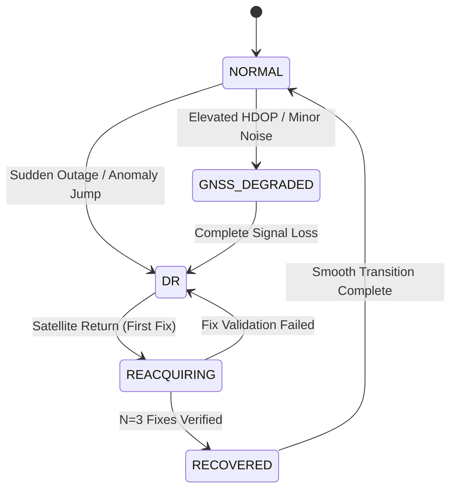

# Navigators Navigation Engine Specification

```
Engine Runtime: src/navigation/confidence_aware_navigation.py, simulator/offline_engine.js
State Modes: NORMAL, GNSS_DEGRADED, HYBRID, DR, REACQUIRING, RECOVERED
```

## Runtime Navigation Architecture

The Navigators Navigation Engine executes real-time multi-modal positioning across vehicle and pedestrian environments.

---

## Navigation State Machine

The core engine transitions between five authoritative operational state modes:

1. **`NORMAL`**: Trusted GNSS fixes are available ($HDOP \le 2.0$, zero anomaly flags). GNSS updates directly drive the 15-state EKF update block.
2. **`GNSS_DEGRADED`**: Satellite accuracy is reduced or HDOP is elevated ($2.0 < HDOP \le 5.0$). EKF scales GNSS measurement covariance $R_{gnss}$ upward and incorporates learned TCN velocity pseudo-measurements.
3. **`DR` (Dead Reckoning)**: Complete GNSS outage or `UNUSABLE` satellite integrity. Positioning relies strictly on Motion Classifier routing $\to$ Domain TCN Model (Vehicle or Pedestrian) $\to$ EKF Propagation $\to$ Non-Holonomic Constraints (NHC) $\to$ Map Projection.
4. **`REACQUIRING`**: Satellite signal has returned following an outage. The engine evaluates incoming GNSS fixes over an $N = 3$ consecutive fix window against dead-reckoning trajectory estimates, map topology, and covariance bounds.
5. **`RECOVERED`**: Signal integrity has been fully verified over the multi-fix window. The engine smoothly transitions back to `NORMAL` trusted GNSS operation.



---

## Independence of GNSS vs. Internet Connectivity

Navigators enforces strict functional independence between satellite positioning signals and network internet connectivity:

- **GNSS Available vs. Internet Available**: GNSS satellite signals arrive directly from orbital satellite constellations to hardware receivers, requiring zero cellular data or internet access.
- **Internet Loss Rule**: Loss of internet, Wi-Fi, or cellular network connection MUST NEVER trigger Dead Reckoning mode. Internet status impacts only map tile synchronization and telemetry upload queues.
- **GNSS Loss Rule**: Dead Reckoning (`DR`) mode is triggered strictly by GNSS satellite loss, high HDOP degradation, or verified GNSS anomaly flags.
- **Validation Rule**: When satellite fixes return after an outage, the returning solution MUST be validated across $N=3$ consecutive fixes before restoring `NORMAL` operational status.
