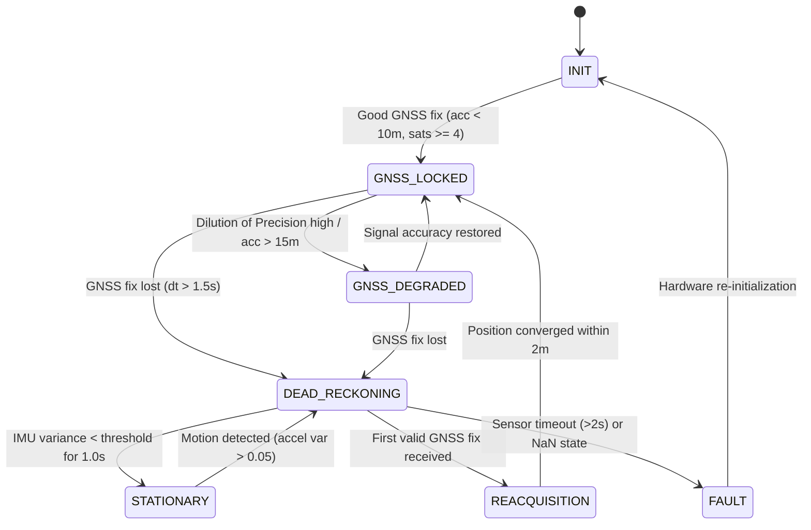

# Navigators — Navigation Engine Specification

```
Document Identifier: NAV-ENG-01
Status: Production Reference
Version: 1.0.0
Last Updated: 2026-09-23
Attribution: Developed by Navigators
```

---

## 1. Engine Overview & Architecture

The Navigators Navigation Engine is an autonomous kinematic state estimator engineered to deliver uninterrupted vehicle location coordinates under arbitrary GNSS degradation or total signal denial. The engine is implemented symmetrically in both Python (`src/navigation/`) for offline benchmarking and evaluation, and JavaScript (`simulator/engine/`) for zero-latency, on-device edge execution.

```
       [Raw IMU Telemetry (Accel, Gyro)]
                      │
                      ▼
       [Causal Denoising & Calibration]
                      │
                      ▼
   [Navigation State Machine (NavState.py / App.js)]
                      │
     ┌────────────────┼────────────────┐
     ▼                ▼                ▼
[GNSS Aided]   [Dead Reckoning]  [Stationary (ZUPT)]
 (Full Fix)     (TCN AI + NHC)     (Zero Velocity)
     │                │                │
     └────────────────┼────────────────┘
                      │
                      ▼
         [15-State Extended Kalman Filter]
                      │
                      ▼
      [Geometric Road Network Map Matcher]
                      │
                      ▼
       [Turn-by-Turn Output Coordinates]
```

---

## 2. Navigation State Machine

The engine transitions between six discrete operating states managed by `NavigationState` in `src/navigation/nav_state.py` and `simulator/engine/pedestrian.js`:



### Detailed State Specifications:
1. **`INIT` (System Initialization)**: The engine boots, loads model weights into WebAssembly, requests browser motion/geolocation permissions, and begins accumulating the initial stationary dwell buffer for gravity alignment.
2. **`GNSS_LOCKED` (Standard GNSS/INS Fusion)**: Satellite positioning is healthy ($\text{accuracy} < 10\text{ m}$). The EKF executes full position and velocity measurement updates. Gyroscope and accelerometer biases are actively estimated and corrected in the state vector.
3. **`GNSS_DEGRADED` (Degraded Satellite Reception)**: Multipath or high dilution of precision detected ($15\text{ m} \le \text{accuracy} \le 30\text{ m}$). The filter increases GNSS measurement noise covariance $\mathbf{R}_{gnss}$ by a factor of $10\times$, placing higher fusion weight on inertial propagation and AI velocity.
4. **`DEAD_RECKONING` (Complete GNSS Denial)**: Satellite reception is lost entirely. The filter ceases GNSS updates and propagates states using IMU integration combined with AI velocity pseudo-measurements from the TCN model and Non-Holonomic Constraints (NHC).
5. **`STATIONARY` (Zero-Velocity Dwell)**: Acceleration dynamic variance drops below $0.05\text{ m/s}^2$ and gyroscope norm drops below $0.05\text{ rad/s}$ for more than $1.0\text{ s}$. The engine freezes position propagation, gates AI velocity inference, and injects Zero-Velocity Updates (ZUPT) to prevent baseline integration drift.
6. **`REACQUISITION` (Anti-Jump GNSS Recovery)**: A valid GNSS fix is received following an outage. The engine clamps the positional correction magnitude to $\le 2.0\text{ m}$ per step over 10 consecutive cycles to smoothly guide the estimated position onto the true satellite fix without UI snapping.
7. **`FAULT` (Sensor Dropout / Anomaly)**: Triggered if motion events cease for $> 2.0\text{ s}$ or if numerical state elements contain NaNs. The filter resets covariance $\mathbf{P}$ to initial default values and attempts recalibration.

---

## 3. Kinematic Sensor Fusion Pipeline

### 3.1 15-State Vector Formulation
The state vector $\mathbf{x} \in \mathbb{R}^{15}$ is defined in the local East-North-Up (ENU) frame:
$$\mathbf{x} = [\mathbf{p}^T, \mathbf{v}^T, \boldsymbol{\theta}^T, \mathbf{b}_a^T, \mathbf{b}_g^T]^T$$
- $\mathbf{p} = [p_E, p_N, p_U]^T$: Cartesian position in meters relative to local origin.
- $\mathbf{v} = [v_E, v_N, v_U]^T$: Cartesian velocity in $\text{m/s}$.
- $\boldsymbol{\theta} = [\phi, \theta, \psi]^T$: Attitude Euler angles (Roll, Pitch, Yaw) in radians.
- $\mathbf{b}_a = [b_{ax}, b_{ay}, b_{az}]^T$: Accelerometer bias estimates in $\text{m/s}^2$.
- $\mathbf{b}_g = [b_{gx}, b_{gy}, b_{gz}]^T$: Gyroscope bias estimates in $\text{rad/s}$.

### 3.2 State Propagation (Prediction Step)
At each IMU timestep $k$ with interval $\Delta t = 0.1\text{ s}$:
1. Bias-corrected angular rates: $\boldsymbol{\omega}_k = \boldsymbol{\omega}_{meas} - \mathbf{b}_g$
2. Bias-corrected linear acceleration: $\mathbf{a}_k^b = \mathbf{a}_{meas} - \mathbf{b}_a$
3. Attitude update: $\boldsymbol{\theta}_k = \boldsymbol{\theta}_{k-1} + \mathbf{E}(\boldsymbol{\theta}_{k-1}) \boldsymbol{\omega}_k \Delta t$
4. Rotation matrix to navigation frame: $\mathbf{R}_b^n = f(\boldsymbol{\theta}_k)$
5. Navigation-frame acceleration: $\mathbf{a}_k^n = \mathbf{R}_b^n \mathbf{a}_k^b - \mathbf{g}^n$
6. Velocity update: $\mathbf{v}_k = \mathbf{v}_{k-1} + \mathbf{a}_k^n \Delta t$
7. Position update: $\mathbf{p}_k = \mathbf{p}_{k-1} + \mathbf{v}_k \Delta t + \frac{1}{2} \mathbf{a}_k^n \Delta t^2$

---

## 4. Constraint Updates (NHC & ZUPT)

### 4.1 Non-Holonomic Constraints (NHC)
For land vehicles travelling on road surfaces without skidding or jumping:
- Lateral velocity in vehicle frame: $v_x^v \approx 0$
- Vertical velocity in vehicle frame: $v_z^v \approx 0$

Transforming into the navigation frame with heading $\psi$:
$$\mathbf{H}_{nhc} = \begin{bmatrix} -\sin\psi & \cos\psi & 0 & \mathbf{0}_{1 \times 12} \\ 0 & 0 & 1 & \mathbf{0}_{1 \times 12} \end{bmatrix}$$
$$\mathbf{z}_{nhc} - \mathbf{H}_{nhc} \hat{\mathbf{x}} = [0 - (-v_E \sin\psi + v_N \cos\psi), 0 - v_U]^T$$
Measurement noise covariance is set to $\mathbf{R}_{nhc} = \text{diag}(1.0, 1.0)\text{ m}^2/\text{s}^2$.

### 4.2 Zero-Velocity Update (ZUPT)
When stationary dwell criteria are confirmed by `ZUPTDetector`:
- Innovation $\mathbf{y} = [0, 0, 0]^T - [v_E, v_N, v_U]^T$
- $\mathbf{H}_{zupt} = [\mathbf{0}_{3 \times 3}, \mathbf{I}_{3 \times 3}, \mathbf{0}_{3 \times 9}]$
- Measurement noise: $\mathbf{R}_{zupt} = \text{diag}(0.01, 0.01, 0.01)\text{ m}^2/\text{s}^2$
This actively contracts velocity error variance and prevents accelerometer bias from accelerating the vehicle while stationary at traffic lights.

---

## 5. Map-Aided Centerline Snapping

The output of the EKF is projected onto the road network graph:
1. **Search Radius**: Queries road segments within $30\text{ m}$ of the current EKF position.
2. **Heading Filter**: Rejects road segments oriented $> 45^\circ$ relative to vehicle heading.
3. **Orthogonal Projection**: Calculates closest point on candidate lines.
4. **Correction Feedback**: Snapped coordinates update display positions; during prolonged dead reckoning, cross-track snapping error is optionally fed back as an EKF measurement update to bound lateral drift.

---

Developed by Navigators
