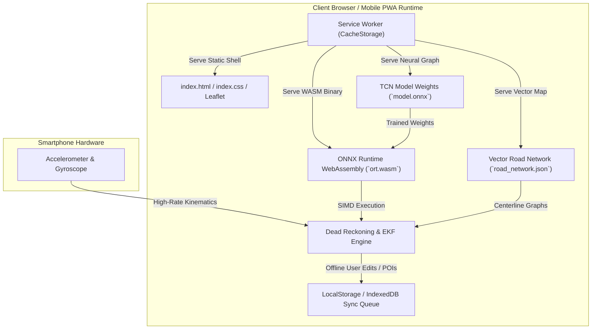

# Navigators — Offline Architecture & Synchronization Protocols

```
Document Identifier: OFF-NAV-01
Status: Production Reference
Version: 1.0.0
Last Updated: 2026-09-23
Attribution: Developed by Navigators
```

---

## 1. Fundamental Conceptual Clarification: Internet Outage vs. GNSS Outage

A common misconception in mobile engineering is conflating cellular internet connectivity with satellite positioning. In Navigators, these are strictly independent physical and operational states:

```
                      GNSS Available             GNSS Denied (Outage)
                ┌─────────────────────────┬─────────────────────────┐
  Internet      │ State A: Standard Run   │ State B: Tunnel Drive   │
  Online        │ Full GNSS + Live Server │ AI Dead Reckoning       │
                │ Telemetry Streaming     │ Cellular Connected      │
                ├─────────────────────────┼─────────────────────────┤
  Internet      │ State C: Remote Highway │ State D: Total Denied   │
  Offline       │ GNSS Satellite Fix      │ Pure Autonomous Offline │
                │ Zero Cellular/Server    │ AI DR + Local Vector Map│
                └─────────────────────────┴─────────────────────────┘
```

- **Internet Outage (Offline Mode)**: Cellular data or Wi-Fi is unavailable (Airplane Mode, rural dead-zones, disaster scenarios). The application must boot from local disk cache, run inference on-device, and persist user interactions locally.
- **GNSS Outage (Satellite Denial)**: Satellite signals are blocked or jammed (tunnels, underground parkings, dense high-rise urban canyons). The application must compute vehicle velocity and position using internal sensors and dead reckoning.
- **Total Denial (State D)**: Both internet and GNSS are absent. **Navigators is specifically architected to maintain continuous navigation under State D.**

---

## 2. Complete Offline Runtime Architecture



### 2.1 Service Worker Cache Strategy (`simulator/sw.js`)
The Service Worker implements a **Cache-First** strategy for all core execution assets:
1. `simulator/index.html`, `index.css`, `app.js`
2. `simulator/vendor/onnxruntime/ort.wasm.min.js`, `ort-wasm-simd-threaded.wasm`
3. `simulator/vendor/leaflet/leaflet.js`, `leaflet.css`
4. `simulator/model.onnx`
5. `simulator/data/road_network.json`

When an update is published, the service worker verifies checksums, swaps the cache atomically in the background, and prompts for a seamless reload.

---

## 3. Local Data Persistence & Vector Storage

1. **Map Data**: Road centerline polylines, intersection nodes, and speed attributes are serialized as a lightweight GeoJSON vector payload ($1.1\text{ MB}$) stored directly in client storage. The application does not require external tile server requests to display the route corridor.
2. **Local Places Cache**: Community-approved places of interest (fuel stations, hospitals, charging points) are stored locally in `LocalMap` (`simulator/local_map.js`), enabling instant search and turn-by-turn routing without backend queries.

---

## 4. Offline Contribution Queue & Sync Protocol

When a user submits a map update, POI creation, or road incident while operating in offline mode:

```
[User Submits Map Contribution in Offline Mode]
                        │
                        ▼
   [Generate UUIDv4 Client-Side Idempotency Key]
                        │
                        ▼
    [Append to LocalStorage `navigators_sync_queue`]
                        │
                        ▼
       [Window 'online' Event Listener Triggers]
                        │
                        ▼
  [Execute Background Replay: POST /api/v1/sync/queue]
                        │
                        ▼
 ┌──────────────────────┴──────────────────────┐
SUCCESS (HTTP 200)                      FAILURE (Network Error)
 │                                             │
 ▼                                             ▼
[Purge Item from Queue]              [Exponential Backoff Retry]
```

### 4.1 Idempotency Key Enforcement
Every queued submission is assigned a unique `client_sync_id` (UUIDv4) upon creation. When the client reconnects and replays the sync queue to `POST /api/v1/sync/queue`:
- The backend checks `sync_queue` in SQLite.
- If `client_sync_id` already exists, the server returns the existing result without creating duplicate records or modifying state twice.

### 4.2 Conflict Resolution
- **Canonical Map Edits**: If an offline contribution edits a place that was concurrently modified or deleted on the server, the server preserves the server record and routes the offline edit into the Moderator review queue with a conflict flag (`status = 'pending_review'`).
- **Telemetry Ingestion**: Ingested sensor sessions are appended immutably to the dataset repository; conflicts do not occur because raw trips are uniquely keyed per device and timestamp.

---

Developed by Navigators
