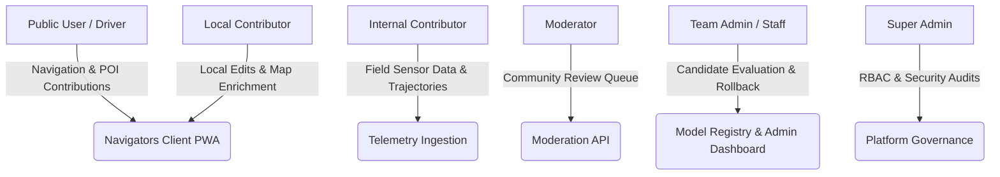

# Navigators :  Product Requirements Document (PRD)

```
Document Identifier: PRD-NAV-01
Status: Production Reference
Version: 1.0.0
Last Updated: 2026-09-23
Attribution: Developed by Navigators
```

---

## 1. Document Purpose & Scope

This document specifies the complete functional, non-functional, mathematical, architectural, and operational requirements for **Navigators**: an intelligent inertial navigation and dead-reckoning system engineered for smartphone-based positioning during GNSS degradation or complete outage.

Every requirement in this document is labeled with a deterministic tracking identifier and mapped to its real implementation within the repository, or explicitly categorized as **PROPOSED / FUTURE WORK** if awaiting deployment.

---

## 2. Product Overview & Problem Definition

### 2.1 The Problem
Global Navigation Satellite System (GNSS) positioning degrades or fails entirely in dense urban canyons, tunnels, underground facilities, parking structures, and during severe multipath or atmospheric interference. Standard smartphone positioning relies on commercial GNSS chips; when satellite lock is lost, standard navigation applications freeze, jump erratically, or extrapolate blindly along pre-computed velocity vectors, accumulating massive positional error within seconds.

### 2.2 The Solution
Navigators implements an autonomous, completely offline, smartphone-centric Dead Reckoning (DR) architecture that fuses:
1. Low-cost Consumer Micro-Electro-Mechanical Systems (MEMS) accelerometer and gyroscope telemetry.
2. A lightweight Temporal Convolutional Network (TCN) trained on vehicle inertial dynamics to predict 2D horizontal velocities ($v_E, v_N$).
3. A 15-state Extended Kalman Filter (EKF) enforcing kinematic Non-Holonomic Constraints (NHC) and Zero-Velocity Updates (ZUPT).
4. Local geometric road network map matching.
5. Smooth, non-jumping GNSS reacquisition algorithms upon signal restoration.

---

## 3. User Scenarios & Stakeholder Personas



1. **Public Driver (Guest / User)**: Navigates urban corridors and underground passes with continuous guidance even when passing through tunnels with zero satellite reception.
2. **Local Contributor**: Submits map updates, road closures, and points of interest (POIs) with offline caching and peer-reviewed moderation triage.
3. **Internal Contributor**: Authenticated field test driver uploading calibrated sensor recordings to train next-generation neural dead-reckoning models.
4. **Moderator**: Reviews community contributions, verifies topological accuracy, and approves entries into the canonical map.
5. **Team Admin / Staff**: Evaluates candidate deep learning checkpoints against benchmark datasets and promotes approved models into edge production.
6. **Super Admin**: Enforces system-wide security, revokes sessions, monitors audit logs, and configures role-based access control.

---

## 4. Functional Requirements

### 4.1 Inertial Sensing & Device Alignment

| Requirement ID | Description | Source Trace | Implementation Status |
| :--- | :--- | :--- | :--- |
| **FR-SENS-001** | Capture 3-axis acceleration (including gravity) and 3-axis angular rates via HTML5 DeviceMotion API at nominal 10 Hz (smartphone event loop). | `simulator/app.js`<br>`src/data/sensor_adapter.py` | IMPLEMENTED |
| **FR-SENS-002** | Compute causal running median (window size 5) and first-order 20 Hz low-pass filtering to suppress high-frequency vehicle vibration without future-sample leakage. | `src/evaluation/preprocessing.py`<br>`simulator/engine/preprocessing.js` | IMPLEMENTED |
| **FR-SENS-003** | Dynamically estimate device-to-vehicle leveling using static gravity vector decomposition during stationary dwell. | `src/navigation/alignment.py`<br>`simulator/engine/alignment.js` | IMPLEMENTED |
| **FR-SENS-004** | Perform forward horizontal heading alignment via Triad algorithm fusing initial GPS velocity vector and linear acceleration. | `src/navigation/alignment.py`<br>`simulator/engine/alignment.js` | IMPLEMENTED |
| **FR-SENS-005** | Fall back to PCA-based principal variance axis alignment when forward acceleration is absent or uncalibrated. | `src/navigation/alignment.py` | IMPLEMENTED |

### 4.2 State Estimation & Kinematic Filtering

| Requirement ID | Description | Source Trace | Implementation Status |
| :--- | :--- | :--- | :--- |
| **FR-NAV-001** | Maintain a 15-dimensional state vector $\mathbf{x} = [\mathbf{p}_{ENU}^T, \mathbf{v}_{ENU}^T, \boldsymbol{\theta}_{roll,pitch,yaw}^T, \mathbf{b}_a^T, \mathbf{b}_g^T]^T$ representing 3D Position, 3D Velocity, 3D Orientation, Accel Bias, and Gyro Bias. | `src/navigation/ekf.py`<br>`simulator/engine/ekf.js` | IMPLEMENTED |
| **FR-NAV-002** | Formulate process covariance $\mathbf{Q}_k$ dynamically scaled by sampling interval $\Delta t$ and configurable power spectral densities. | `src/navigation/ekf.py`<br>`simulator/engine/ekf.js` | IMPLEMENTED |
| **FR-NAV-003** | Execute state covariance update using Joseph-form numerically stabilized formulation: $\mathbf{P} = (\mathbf{I}-\mathbf{K}\mathbf{H})\mathbf{P}(\mathbf{I}-\mathbf{K}\mathbf{H})^T + \mathbf{K}\mathbf{R}\mathbf{K}^T$. | `src/navigation/ekf.py`<br>`simulator/engine/ekf.js` | IMPLEMENTED |
| **FR-NAV-004** | Detect stationary dwell states (ZUPT) when acceleration dynamic variance $< 0.05\text{ m/s}^2$ and gyroscope norm $< 0.05\text{ rad/s}$ across $\ge 1.0\text{ s}$ dwell window. | `src/navigation/zupt.py`<br>`simulator/engine/pedestrian.js` | IMPLEMENTED |
| **FR-NAV-005** | Apply Zero-Velocity Updates (ZUPT) by setting measurement innovation $\mathbf{z} = [0, 0, 0]^T$ with measurement noise covariance $\mathbf{R}_{zupt} = \text{diag}(0.01, 0.01, 0.01)$. | `src/navigation/ekf.py`<br>`simulator/engine/ekf.js` | IMPLEMENTED |
| **FR-NAV-006** | Enforce Non-Holonomic Constraints (NHC) assuming zero lateral skid ($v_y \approx 0$) and zero vertical lift ($v_z \approx 0$) in vehicle body frame during forward motion. | `src/navigation/nhc.py`<br>`simulator/engine/ekf.js` | IMPLEMENTED |
| **FR-NAV-007** | Implement smooth anti-jump GNSS reacquisition bounding position correction magnitude to $\le 2.0\text{ m}$ per step over a 10-step convergence window. | `src/navigation/ekf.py`<br>`simulator/engine/ekf.js` | IMPLEMENTED |

### 4.3 Neural Velocity Regression (Edge AI)

| Requirement ID | Description | Source Trace | Implementation Status |
| :--- | :--- | :--- | :--- |
| **FR-ML-001** | Process 200-sample sliding windows of 6-axis IMU features ($20\text{ s}$ at $10\text{ Hz}$) normalized via z-score scaling. | `src/models/tcn_model.py`<br>`simulator/engine/preprocessing.js` | IMPLEMENTED |
| **FR-ML-002** | Predict 2D horizontal vehicle velocity vector $[v_N, v_E]$ in meters per second. | `src/models/tcn_model.py`<br>`simulator/model.onnx` | IMPLEMENTED |
| **FR-ML-003** | Enforce causal convolution architecture using left padding only: $(K - 1) \times d$ left-pad, ensuring output at timestep $t$ depends strictly on $t' \le t$. | `src/models/tcn_model.py` | IMPLEMENTED |
| **FR-ML-004** | Execute neural inference directly in client browser using ONNX Runtime WebAssembly with SIMD acceleration (`ort-wasm-simd-threaded.wasm`). | `simulator/app.js`<br>`simulator/vendor/onnxruntime/` | IMPLEMENTED |
| **FR-ML-005** | Gate neural inference when vehicle is stationary to eliminate low-speed velocity hallucination. | `simulator/engine/pedestrian.js` | IMPLEMENTED |

### 4.4 Offline Execution & Map Matching

| Requirement ID | Description | Source Trace | Implementation Status |
| :--- | :--- | :--- | :--- |
| **FR-MAP-001** | Store road network topology as local GeoJSON vector segments in client IndexedDB / LocalStorage. | `simulator/local_map.js`<br>`simulator/data/road_network.json` | IMPLEMENTED |
| **FR-MAP-002** | Snap estimated coordinates to road centerline geometries based on Euclidean distance and heading alignment threshold ($\le 45^\circ$). | `src/navigation/map_matching.py`<br>`simulator/engine/map_matcher.js` | IMPLEMENTED |
| **FR-MAP-003** | Function completely offline without cellular, internet, or backend API access during vehicle navigation. | `simulator/sw.js`<br>`simulator/offline_engine.js` | IMPLEMENTED |
| **FR-MAP-004** | Queue offline user contributions, POIs, and incident reports locally with automatic idempotency-keyed replay upon reconnection. | `simulator/workspace.js`<br>`src/api/sync.py` | IMPLEMENTED |

### 4.5 Security, Authorization & Contributor Workflows

| Requirement ID | Description | Source Trace | Implementation Status |
| :--- | :--- | :--- | :--- |
| **FR-SEC-001** | Centralize permission checks in `AuthorizationService` enforcing 7 roles and 40+ granular permissions. | `src/db/authorization.py`<br>`src/db/rbac.py` | IMPLEMENTED |
| **FR-SEC-002** | Enforce strict IDOR and ownership controls: draft contributions and non-approved telemetry are private to authors unless caller is Staff. | `src/api/contributions.py`<br>`src/api/datasets.py` | IMPLEMENTED |
| **FR-SEC-003** | Enforce formal lifecycle state machine transitions for contributions: `DRAFT -> SUBMITTED -> PENDING_REVIEW -> APPROVED -> PUBLISHED`. | `src/db/state_machine.py`<br>`src/db/contributions.py` | IMPLEMENTED |
| **FR-SEC-004** | Prohibit candidate ML models from auto-promoting to production without manual administrative validation and approval. | `src/db/model_registry.py`<br>`src/api/model_registry.py` | IMPLEMENTED |

---

## 5. Non-Functional Requirements

### 5.1 Performance & Latency
- **NFR-PERF-001**: Model inference latency on modern smartphone processors via WebAssembly SIMD must execute in $\le 5.0\text{ ms}$ per 200-sample window. (Measured development baseline on Apple Silicon M-series: $0.7\text{ ms}$; smartphone hardware unvalidated).
- **NFR-PERF-002**: Filter propagation cycle ($\Delta t = 0.1\text{ s}$) must complete within $\le 2.0\text{ ms}$ on client device.
- **NFR-PERF-003**: Service Worker cache initialization must load local map tiles and model weights within $\le 3.0\text{ s}$ on initial launch.

### 5.2 Reliability & Data Integrity
- **NFR-REL-001**: Zero Ground-Truth Leakage: The replay evaluator and training pipelines must strictly isolate GNSS ground truth from the estimator during outage intervals.
- **NFR-REL-002**: Database integrity enforced through SQLite foreign key cascades, unique constraints, and WAL (Write-Ahead Logging) mode.
- **NFR-REL-003**: Offline sync operations must be idempotent; duplicate submissions with identical sync IDs must be discarded without state corruption.

### 5.3 Privacy & Security
- **NFR-SEC-001**: Raw telemetry collection requires explicit user opt-in consent recorded in database audit records.
- **NFR-SEC-002**: In offline navigation mode, zero location coordinates, sensor telemetry, or device identifiers are transmitted outside the device.
- **NFR-SEC-003**: Session tokens must be stored as SHA-256 hashes in the database; raw bearer tokens must never be persisted in plain text.

---

## 6. Traceability Matrix

```
Requirement ID  --> Implementation File                     --> Test File
--------------------------------------------------------------------------------------------------------
FR-SENS-001     --> simulator/app.js                        --> tests/vehicle_motion_detection.test.cjs
FR-SENS-002     --> src/evaluation/preprocessing.py         --> tests/test_alignment.py
FR-SENS-003     --> src/navigation/alignment.py             --> tests/test_alignment.py
FR-NAV-001      --> src/navigation/ekf.py                   --> tests/test_ekf.py
FR-NAV-004      --> src/navigation/zupt.py                  --> tests/vehicle_motion_detection.test.cjs
FR-NAV-006      --> src/navigation/nhc.py                   --> tests/test_dead_reckoning.py
FR-NAV-007      --> src/navigation/ekf.py                   --> tests/offline_navigation.test.cjs
FR-ML-001       --> src/models/tcn_model.py                 --> tests/test_models.py
FR-ML-004       --> simulator/model.onnx                    --> scripts/verify_onnx.py
FR-MAP-001      --> simulator/local_map.js                  --> tests/offline_navigation.test.cjs
FR-SEC-001      --> src/db/authorization.py                 --> tests/test_security_matrix.py
FR-SEC-002      --> src/api/contributions.py                --> tests/test_ownership_rules.py
FR-SEC-003      --> src/db/state_machine.py                 --> tests/test_state_machine.py
```

---

## 7. Known Operational Limits

1. **Physical Smartphone Validation**: While 288/288 automated integration tests pass in software simulation, field road testing on a physical moving smartphone with genuine GNSS loss remains **NOT YET EXPERIMENTALLY VALIDATED**.
2. **Prolonged Outage Drift**: In the absence of map constraints or periodic ZUPT zero-velocity stops, pure inertial dead reckoning error grows quadratically with time due to sensor bias instability.
3. **Thermal Throttling**: Extended continuous sensor capture and WebAssembly inference on low-tier mobile devices may induce thermal throttling and reduce sensor sampling rates below nominal $10\text{ Hz}$.

---

Developed by Navigators
