# Navigators System Architecture

```
System Version: 1.0.0
Architecture Pattern: Edge-First Multi-Modal Inertial Navigation
```

## System Overview

Navigators is an edge-first navigation system engineered to maintain high-accuracy vehicle and pedestrian positioning during Global Navigation Satellite System (GNSS) degradation or complete outage.

The architecture separates execution into two principal tiers:
1. **Client-Side Edge Runtime**: Autonomous positioning, motion classification, deep velocity inference, Kalman filtering, and map matching executing inside client runtimes (web browser, PWA, or smartphone process).
2. **Engineering & Control Backend**: A FastAPI service for dataset ingestion, training pipeline orchestration, model candidate registration, vector map pack serving, and security governance.

---

## Architectural Block Diagram

```mermaid
flowchart TB
    subgraph ClientEdgeTier["Client Edge Tier (Smartphone / PWA Runtimes)"]
        Sensors["Smartphone Sensors<br/>(Accel, Gyro @ 10-50 Hz)"] --> Preproc["Preprocessing & Normalization"]
        Preproc --> MotionClass["Motion Classifier & Router<br/>(Stationary / Pedestrian / Vehicle)"]
        
        MotionClass -->|"Vehicle Mode"| VehTCN["Vehicle TCN Velocity Regressor"]
        MotionClass -->|"Pedestrian Mode"| PedTCN["Pedestrian TCN Velocity Regressor"]
        
        VehTCN --> FusionEngine["Adaptive EKF & Trust Engine<br/>(15-State EKF + 6-Axis Anomaly Filter)"]
        PedTCN --> FusionEngine
        
        GNSSFix["GNSS Fix (When Available)"] -.->|"Integrity Verification"| FusionEngine
        
        VectorMap["Vector Map Data<br/>(IndexedDB / LocalStorage)"] --> MapMatcher["Topological Map Matcher"]
        FusionEngine -->|"Fused Position"| MapMatcher
        MapMatcher --> RenderUI["Navigation UI & Canvas Renderer"]
    end

    subgraph BackendTier["Engineering & Governance Backend (FastAPI)"]
        RESTAPI["REST API Router Layer"]
        SecurityEngine["Authentication & RBAC<br/>(7 Roles, Token Store)"] --> RESTAPI
        DBLayer[(Relational Database<br/>SQLite / PostgreSQL)] <--> RESTAPI
        
        RESTAPI --> TrainingPipeline["ML Training & Optimization Suite"]
        RESTAPI --> ModelRegistry["Model Registry & Promotion Gate"]
        RESTAPI --> MapTileDist["Offline Map Tile Pack Distribution"]
    end
```



---

## Tier Responsibilities and Boundaries

### Edge Execution Tier
- **Zero Internet Dependence**: Navigation state propagation, motion inference, EKF filtering, and map matching execute strictly locally on client hardware.
- **Sensor Ingestion**: Ingests tri-axial acceleration and angular velocity at frequencies up to 50 Hz.
- **State Estimation**: Manages the 15-state error formulation tracking 3D position, 3D velocity, 3D attitude, accelerometer biases, and gyroscope biases.

### Backend Control Tier
- **Dataset Registry**: Ingests, validates, and manages immutable datasets with full provenance.
- **Model Registry**: Manages model staging, validation metrics verification, and team-admin approval workflows before promoting model candidates to production status.
- **RBAC & Governance**: Enforces 7 distinct system roles and atomic permission policies across dataset and model deployment operations.
