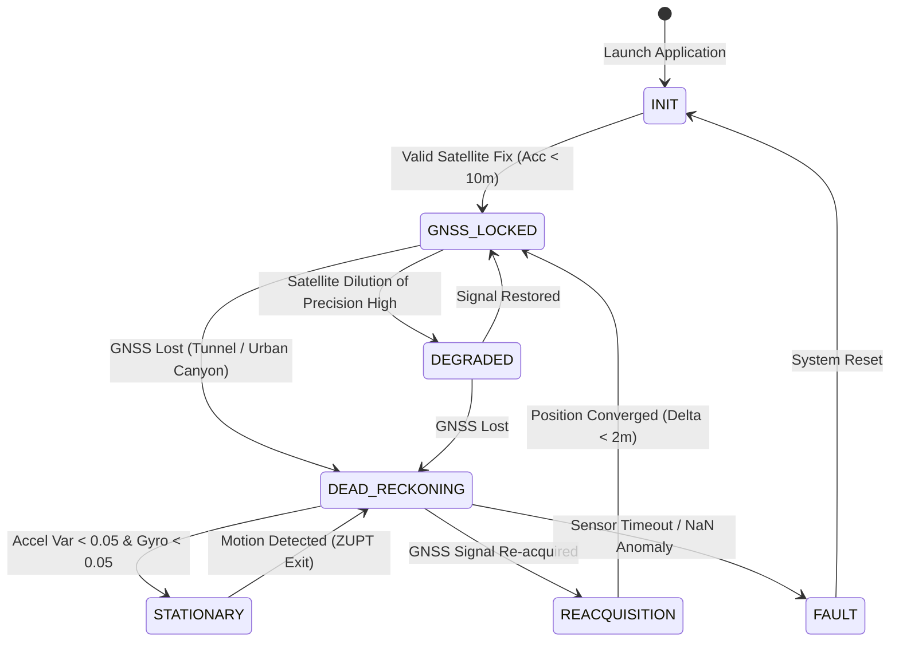
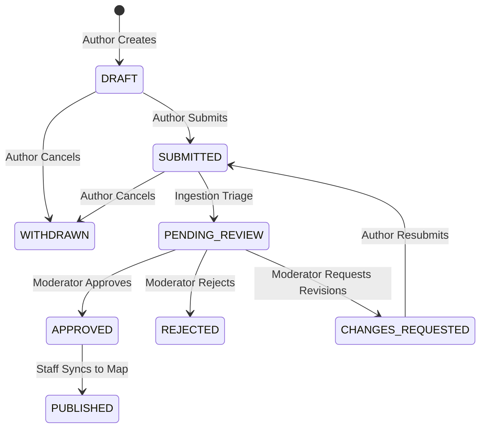

# Navigators — System Design Document

```
Document Identifier: SDD-NAV-01
Status: Production Reference
Version: 1.0.0
Last Updated: 2026-09-23
Attribution: Developed by Navigators
```

---

## 1. System Overview & Boundaries

Navigators is structured into two completely decoupled operational realms:
1. **The Edge Runtime System (Client Tier)**: An autonomous Progressive Web App (PWA) operating locally on consumer smartphones. It executes sensor ingestion, dynamic alignment, causal noise filtering, neural velocity estimation (ONNX Runtime Wasm), 15-state EKF sensor fusion, local vector map matching, and offline storage. **It requires zero server connection during navigation.**
2. **The Engineering, Training & Governance System (Backend Tier)**: A Python FastAPI application backed by SQLite and PyTorch. It provides telemetry ingestion, model training loops, model registry evaluation, canonical map curation, and role-based access governance.

```mermaid
flowchart TB
    subgraph ClientEdge["Edge Runtime Tier (Smartphone Browser / PWA)"]
        Sensors["Hardware Sensors (Accel, Gyro, Magnetometer)"]
        Preproc["Causal Preprocessing & Triad Alignment"]
        ONNX["ONNX Runtime Web (Wasm SIMD)"]
        EKF["15-State Extended Kalman Filter"]
        MapMatch["Geometric Vector Map Matcher"]
        LocalStore["Client LocalStorage / IndexedDB / SW Cache"]
        ClientUI["Navigation Leaflet Canvas & Telemetry HUD"]
    end

    subgraph BackendServer["Engineering & Governance Tier (Python / FastAPI)"]
        API["FastAPI Application Server"]
        Authz["AuthorizationService & RBAC Engine"]
        DB[(SQLite Relational Database)]
        ModelReg["Model Registry & Validation Pipeline"]
        TrainPipe["PyTorch Training Loop & ONNX Exporter"]
        AdminUI["Mac Engineering Dashboard"]
    end

    Sensors -->|Raw Motion Events| Preproc
    Preproc -->|Normalized 200-sample Window| ONNX
    Preproc -->|Calibrated Angular Rates & Accel| EKF
    ONNX -->|Predicted 2D Velocity [v_N, v_E]| EKF
    EKF -->|Filtered ENU State| MapMatch
    LocalStore -->|Cached Road Network GeoJSON| MapMatch
    MapMatch -->|Snapped Lat/Lon Coordinates| ClientUI

    ClientUI -.->|Queued Sync Replay (When Online)| API
    API --> Authz
    Authz --> DB
    DB --> ModelReg
    ModelReg --> TrainPipe
    AdminUI -->|Manage Roles / Review Models| API
```

---

## 2. Component Responsibilities & Interfaces

### 2.1 Edge Runtime Components

| Component | Responsibility | Inputs | Outputs | Primary File |
| :--- | :--- | :--- | :--- | :--- |
| **Motion Ingest & Buffer** | Samples HTML5 `devicemotion` events at 10 Hz; maintains rolling FIFO buffer of 200 samples. | Raw device acceleration and rotation rate. | Windowed tensor $(200, 6)$. | `simulator/app.js` |
| **Causal Filter** | Applies running median filter ($N=5$) and 1st-order low-pass filter ($20\text{ Hz}$) without future-sample leakage. | Raw sensor stream. | Denoised sensor stream. | `simulator/engine/preprocessing.js` |
| **Triad Alignment** | Estimates coordinate transform matrix $\mathbf{R}_b^v$ mapping phone frame to vehicle frame using gravity and initial acceleration. | Stationary gravity vector + forward acceleration vector. | $3 \times 3$ Rotation Matrix $\mathbf{R}_b^v$. | `simulator/engine/alignment.js` |
| **Edge Neural Estimator** | Evaluates TCN model using WebAssembly SIMD; predicts vehicle velocity in North/East coordinates. | Normalized 200-sample window $(1, 200, 6)$. | Vector $[v_N, v_E]$ in $\text{m/s}$. | `simulator/model.onnx`<br>`simulator/vendor/onnxruntime/` |
| **15-State EKF** | Propagates kinematics; fuses AI velocity, GNSS (when valid), NHC constraints, and ZUPT updates. | Calibrated IMU, AI velocity, GNSS fixes. | 15-state vector $\mathbf{x}$ and covariance $\mathbf{P}$. | `simulator/engine/ekf.js` |
| **Map Matcher** | Projects continuous dead-reckoning coordinates onto local road network segments; eliminates transverse drift. | Raw ENU coordinates + Heading. | Snapped road coordinates. | `simulator/engine/map_matcher.js` |
| **Offline Cache** | Serves static assets, model weights, wasm binaries, and road network vector data during complete network outages. | HTTP requests from browser. | Cached file bytes from Service Worker. | `simulator/sw.js` |

### 2.2 Backend Engineering Components

| Component | Responsibility | Inputs | Outputs | Primary File |
| :--- | :--- | :--- | :--- | :--- |
| **API Server** | Handles HTTP REST endpoints, session verification, rate limits, and audit event dispatch. | HTTP Requests. | JSON Responses / HTTP Status. | `src/api/server.py` |
| **Authorization Service** | Validates session roles, permissions, object ownership, and allowed state transitions. | SessionContext, action string, target resource. | AuthorizationDecision (`allowed`, `reason`, `code`). | `src/db/authorization.py` |
| **Contribution Repo** | Manages crowdsourced road features and POIs via a deterministic 5-stage lifecycle. | Contribution payloads, reviewer decisions. | Canonical place entities. | `src/db/contributions.py` |
| **Model Registry** | Stores ML candidate model metadata, evaluation metrics, approval status, and production flags. | Model weights, evaluation records. | Deployment status. | `src/db/model_registry.py` |
| **Database Layer** | Provides relational storage across 19 SQLite tables with foreign key cascades and WAL mode. | SQL queries and parameters. | Structured row tuples. | `src/db/database.py`<br>`src/db/schema.sql` |

---

## 3. Data Flow & State Lifecycle

### 3.1 Navigation State Machine

The client navigation engine executes a deterministic finite state machine governed by GNSS quality, velocity estimates, and sensor variance:



### 3.2 Contribution Lifecycle State Machine

Community contributions (POI additions, road updates) adhere to strict state transition rules enforced by `ContributionStateMachine` in `src/db/state_machine.py`:



---

## 4. Storage Architecture

### 4.1 Client Local Storage (Edge)
- **Service Worker Cache**: Stores `index.html`, `index.css`, `app.js`, `model.onnx`, `ort-wasm-simd-threaded.wasm`, and Leaflet map assets.
- **IndexedDB / LocalStorage**: Stores road network GeoJSON geometries (`road_network.json`) and an offline contribution queue (`workspace.js`).

### 4.2 Backend Relational Storage (SQLite)
The backend utilizes SQLite with WAL (`PRAGMA journal_mode=WAL; PRAGMA foreign_keys=ON;`). The schema comprises 19 normalized tables:
- **Core Entities**: `users`, `roles`, `permissions`, `role_permissions`, `user_roles`, `auth_identities`, `sessions`.
- **Cartographic Entities**: `places`, `contributions`.
- **Engineering Entities**: `datasets`, `dataset_sessions`, `training_jobs`, `models`, `model_evaluations`.
- **Operations & Security**: `internal_access_requests`, `incident_reports`, `sos_alerts`, `audit_logs`, `sync_queue`.

---

## 5. Security & Boundary Enforcement

1. **Authentication Boundary**: All secured endpoints require an HTTP Bearer header containing a raw token. The server hashes the incoming token using SHA-256 and validates the hash against active records in `sessions`. Expired or revoked sessions return HTTP 401.
2. **Authorization Boundary**: The central `AuthorizationService` independently computes permissions using the caller's assigned roles in `user_roles`. Role escalation is strictly prohibited; users cannot grant permissions beyond their own hierarchy.
3. **IDOR & Data Boundary**: Unapproved user contributions and raw training session telemetry are invisible to other regular users. Query filtering at the repository layer ensures non-staff callers only access public canonical data or their own personal drafts.

---

Developed by Navigators
