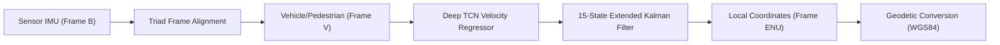

# Navigators Technical Architecture

```
Technical Stack: Python 3.14, PyTorch, FastAPI, ONNX Runtime, JavaScript (ES2022)
Database: SQLite (WAL mode) / PostgreSQL
```

## Technology Stack and Component Blueprint

Navigators utilizes a decoupled technical architecture optimized for high performance, strict typing, and cross-platform deployment.

### 1. Machine Learning and Inference
- **PyTorch**: Deep learning framework used for training specialized Temporal Convolutional Networks (TCN) and ResNet1D velocity estimation models.
- **ONNX Runtime (Python & Web)**: Standardized cross-platform inference framework enabling seamless execution of trained models across Python services and client-side browser runtimes (`onnxruntime-web`).

### 2. Core Navigation and Mathematics
- **NumPy & SciPy**: C-accelerated array processing, linear algebra, vector projections, and matrix operations for the 15-state Extended Kalman Filter (EKF).
- **Client-Side Engine**: Pure JavaScript ES2022 implementation (`simulator/offline_engine.js`) providing lightweight, zero-dependency browser navigation.

### 3. Backend Services and API
- **FastAPI**: Asynchronous Python web framework delivering high-throughput REST endpoints, OpenAPI schemas, and strict request/response data validation.
- **Uvicorn**: ASGI web server running FastAPI backend processes.
- **Pydantic v2**: Data validation and serialization layer defining immutable API contracts.

### 4. Database and Storage Layer
- **SQLite / PostgreSQL**: Relational storage tier managing 19 database tables, foreign key constraints, session tokens, audit trails, dataset registries, and model candidate metadata.

---

## Coordinate Transformations and Pipeline Overview

Navigators uses four primary coordinate reference frames:

1. **Sensor Body Frame (B)**: Smartphone physical accelerometer and gyroscope axes.
2. **Vehicle Kinematic Frame (V)**: Forward (longitudinal), Right (lateral), and Down/Up (vertical) vehicle body directions.
3. **Local East-North-Up Frame (ENU)**: Tangent-plane Cartesian coordinate system centered at local navigation origin.
4. **Geodetic Frame (WGS84)**: Global Latitude, Longitude, and Ellipsoidal Altitude coordinates.


